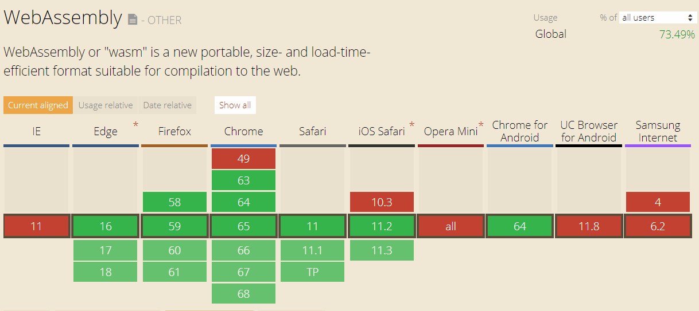

# Death Of Javascript; Writing Client side code from Angular, React, Vue to C# blazor

or 

# Replacing Angular,React, Vue, Javascript with C# for Building Client Side Application

or

# Death of Javascript; Long live C#

Or

# How to replace Javascript with C# for Client side coding…
Or

# Write C# .Net code for Client Side Application development

Or 

# C# Renaissance, writing frontend code using C#

#Blaze your way with c#

Are you a C#, C++ developer and Javascript never made sense for you while writing the Client Side Applications?
You are in for a good Surprise, Microsoft Asp.net team has announced the Experimental Version of Blazor as first Public preview on 6th Feb. Blazor let's you use all your C# knowlegde to Apply in Client Side development. Blazor replaces Javascript Code with C#. Essentially, it means that rather then writing the Client side code in Angular, React, Vue you can use C# and Razor. Does that sound a dream ??Continue reading...

## History Of Blazor 

Last Year, Steve Sanderson (The Creator Knockout.js) started working on an side project Blazor. After his NDC Demo at OSLO and the positive feedback for Blazor. The ASP.Net team created a Experimental version of Blazor.

### What's in the Name Blazor

### Blazor = Browser + Razor

Blazor gets it name from the Razor which most ASP.Net MVC developers would be Familiar with. Razor is a markup syntax for HTML and C#. Moreover, it runs on the Browser and Hence combine the power of Browser and Razor.

## What is Blazor?

>Blazor is a Single page web application (SPA) framework built on .NET that runs in the browser via WebAssembly.

It’s a framework for client-side applications written in .NET, running under WebAssembly. It offers all the benefits of the rich, modern single-page application (SPA) platform. Additionaly, it allows to use .Net throughout the code base. It means that we can write the code for the Client, Server in the same technology (.Net). Additionaly, Same classes can be shared by both client and server code. Blazor is based on existing web technologies like HTML and CSS, but you use C# and Razor syntax instead of JavaScript to build composable web UI.

## What is Web Assembly?

**Web Assembly is a Web Standard to promote native performance on the web.**  It defines a low level format **allowing the developers to write the code in High level Languages (C, C++) and compile the code into WebAssembly.** The Web Assembly can then be executed by the Browser at nearly the native speed. Web Assembly is supported by all modern Browsers (Firefox, Chrome, Edge, Safari). It is a low-level assembly-like language with a compact binary format that runs with near-native performance.

WebAssembly is designed to complement and run alongside JavaScript. Web Assembly Modules can be invoked from Javascript and vice versa.  Use cases of Web assembly includes 3D games, Virtual and Augmented Reality, computer vision, image/video editing, and a number of other domains that demand native performance.

## The Importance of Web Assembly.

Running .NET in the browser is made possible by WebAssembly.  This is the foundational piece needed to build a .NET runtime that can run in the browser. **No plugins or transpilation needed.** You run normal .NET assemblies in the browser using a WebAssembly based .NET runtime.

## How Blazor works using Web Assembly?

The client application (Client Web Project) is compiled as .Net assembly. When the Application is requested by browser, the Browser downloads the required dll as defined in the client Project and runs in a web browser using a WebAssembly based .NET runtime. **Only the .NET runtime itself is compiled to WebAssembly.**  In future, the Dll would be cached using HTTP Caching to reduce the download cost. 

As of now, Blazor runs on Mono, which has  larger size, but there are opportunities for size optimization, including merging and trimming the runtime and application binaries and the future releases would be targetting this optimizations.

## Does C# replaces Javascript?

Blazor allows to replace the javascript with C#. Strictly, Blazor is not meant to be a replacement of javascript but a Complementary language to Javasript. It is a client side solution based on html, and CSS. C# is replacing the js part using web assembly. So nothing has changed on how you access / modify html controls. Also, JS and C# code can interact with Each other. There is a facility to interop, meaning we can call the Javascript code from C# code and vice-versa.

## Why blazor is helpful to a C# Developer?

Blazor allows the .Net Developer to Utilize  existing skills for the Client-Side development. It enables the developers to Write fast Single Page Applications build on a Component based Model based on open web standards. .Net Developers can use languages like C# , F# and use the familiar standard APIs, tools, and build infrastructure across all .NET platforms.

### Sharing Code

How many times does it happen that we write Models/Class in the Web API and then create the same Classes in the Javascript/Typescript in the Client Side Proec? This is pretty normal for most of the applications.  Blazor helps to share the code by allowing the same Models/Class to be reused in the Client Side as well as Server side. For e.g. We can create a Shared Dll defining the class and then reuse the Class in Client Side and Server side by adding References to the shared dll.

## Features

Blazor is inspired by existing modern single page app frameworks, like React, Angular, and Vue, but is also a new framework in its own right.

Blazor will support all of the features of a modern single page app framework:

* A component model for building composable UI
* Routing
* Layouts
* Forms and validation
* Dependency injection
* JavaScript interop
* Live reloading in the browser during development
* Server-side rendering
* Full .NET debugging both in browsers and in the IDE
* Rich IntelliSense and tooling
* Ability to run on older (non-WebAssembly) browsers via asm.js
* Publishing and app size trimming

## Is it stable, Can we use it in Production?

Blazor is an **experimental** project because there are still lots of questions to answer about its viability and appeal. The purposes of this initial experimental phase is to work through the any outstanding technical issues, to gauge interest and to listen to feedback. It's not a committed Product.

## Browser Support?

All the modern browsers support the WebAssembly. Following images shows the browser support for WebAssembly. It's even work in certain Mobile browsers. For IE 11, it has a transpiler. For older browsers that don't support WebAssembly Blazor will fallback to using an asm.js based .NET runtime. Using asm.js is slower and has a larger download size, but is still quite functional.

## Any relation to Silverlight/XAML?

If you are familiar with Silverlight, it might seem simmilar. But hold on, It doesn't bear resemblance with Silverlight. Blazor doesn't require any plugin support in the browser. It doesn't use XAML and is based on HTML and CSS that runs in the browser using open web standards. Addtionally, it works on mobile devices and older browsers.

## What about Garbage Collection

Since the Blazor loads the .Net runtime. The .NET runtime handles its own garbage collection and threading concerns.

## Can I use existing JavaScript libraries with Blazor?

Yes, Blazor applications can call into JavaScript through JavaScript interop APIs. You can call JS from C# code and vice versa.

You can access the DOM through JavaScript interop from .NET code. However, Blazor is a component based framework that minimizes the need to access the DOM directly.

## Summary
In this article, we looked at a promising experimental product, Blazor. Blazor provides a .Net based framework for building client side applications replacing Javascript with the C#, while still using HTML and CSS. Try the blazor at and provide feedback to Asp.Net team.

## References
