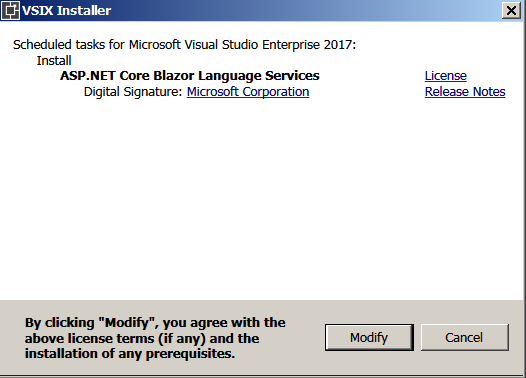

# Hands on with Blazor

## Pre-Requiste 
In this section, i will describe the Framework and the Tooling setup required to create a new blazor application.

### 1. Get the latest .Net Core

Install the .NET Core 2.1 Preview 2 SDK. You will need version 2.1.300-preview2-008533. The version information can be fetched by running `dotnet --version` on the command line.

  

### 2. Get the latest Visual Studio

Install the latest preview of Visual Studio 2017 (15.7) with the ASP.NET and web development workload. 


### 3. Get the Tooling Support for Blazor in visual Studio.

Install the ASP.NET Core Blazor Language Services extension from the Visual Studio Marketplace.

# TODO: Add dialog to show how to add Blazor



## Project Creation in Visual Studio

# TODO : Add gif


1. Select File -> New Project -> Web > .Net Core -> ASP.net Core Web Application.

2. Enter the name of the Project and Location where the project will be saved.

3. Select the Blazor Template and Press OK.

4. Run the application. Press Ctrl-F5 to run the app without the debugger. 

>Note: Running with the debugger (F5) isn't supported at this time.

At this time, you can see an application running with 3 sub menus on the left side. Try playing with each Sub menu and access the virtual pages Home, Counter, and Fetch Data. There is **NO** Javascript code.  Only HTML, CSS and C#..

## What are various files Visual Studio Created in the Solution?

The default template creates 2 folders, `Pages` and `Shared` and HTML, CSS, CSHTML (Razor Views), and most importantly **C#** files. Each CSHTML file represents a Blazor component which has the Razor and the C# code.

>Notice, there aren't any JS files in the Solution.,

## What are we creating?

In this article, i will show a demonstration of Pomodoro. Pomodoro is a useful tool for managing distractions and ending the procastination jungle..
If you need more information regarding Pomodoro, please read here (http://). A simpler way to understand the Pomodoro is to think about the Countdown timer, with Start and Stop.

We will see how to achieve the Pomodoro/Countdown timer in C# and then compare the code with the Javascript implmentation.


## Adding the Razor View to the Project

1. Select Pages Folder in the Visual Studio Solution. Right Click and AA


## Bootstrap of Razor
Upon building of A Razor Application, the Script tag replaced with another script tag containing the Blazor and other dependent dll

Following highligted  replaced with the Code for the DLL Loading..


when you build the blazor app this script tag will actually get replaced. it'll get replaced with another script tag that references the a piece of JavaScript that's used to bootstrap the donet runtime within the browser and also to point it at the applications entry points.  
so you see this script tag here  so here it got that that's the blazer blazer boot script that got replaced and it's we replaced it with a reference to this blazer that j/s file "<script src="_framework/blazor.js" " this is what's gonna get the web assembly code for the.net runtime up and running.

 it also has the main entry point for the application  main="FirstBlazor.dll" entrypoint="FirstBlazor.Program::Main"  so there's the web application - is the DLL that was built from my project and then as all the references that are needed by the application this is all the references that were specified as part of the compilation step trimmed down -


 just the things that that we know are absolutely needed so we actually do on every build aisle stripping will remove assemblies that aren't used and il code from assemblies that aren't actually used at all in fact so if we go back to the app and try to build again make it the output up let's see if we can do a rebuild we should see that so if we watch the the output spew by hopefully. t's like pulling out all this stuff that my app doesn't actually need and that helps reduce the size of the the application payload and I'll reduce load times now this is just saying that reducing the load time


Every Blazor Component is defined by any CSHTML File. IT generates a strongly typed name..


Why do we have this?
    <app>Loading...</app>

App is the root component.

    <!-- The DOM element selector argument determines where the root component will get rendered.
        In our case, the app element in index.html is used. 
        This gets displayed only till the time the blazor component is loading..
        -->

Where is the .Net Runtime getting loaded?
Mono.wasm. A lot of optimizations coming, which will remove the code..


Tooling
Intellisense available for components..

Note: Live Reload not yet there..

Components
Can be paramererize like Attributes, and defined like properties in the blazor componennt


How do you do Layout in Blazor?

<!-- TO define the layout of all the pages.-->
@layout MainLayout

## Base page for the Application

`index.html` serves as the Base Page/Starting Page for the Application. It also initiates the loading of the Blazor Runtime.

## Bootstrapping the Runtime

At build-time the **blazor-boot** script tag is replaced with a bootstrapping script that handles starting the .NET runtime and executing the app's entry point. 

```

  <script src="css/bootstrap/bootstrap-native.min.js"></script>
    <!--Bootstrapping the runtime
    At build-time the blazor-boot script tag is replaced with a bootstrapping script that 
        handles starting the .NET runtime and executing the app's entry point.
        You can see the updated script tag using the browser developer tools. -->
    <script type="blazor-boot">
    </script>

```


You can see the updated script tag using the browser developer tools. -->

@bind syntax is going to Change..

## Defining the Root Component

The file program.cs has the link to the Root Component of the Application and the **Selector** component.

`new BrowserRenderer(serviceProvider).AddComponent<App>("app");` 

Name of the component=App  
Selector="app"

## Using the Root Component

In the index.html file, the `<app>Loading...</app>` component defines the selector `app` which we defined in the earlier step. The `loading...` is displayed until the `App` component which is completely loaded.

```
<body>
    <!-- The DOM element selector argument determines where the root component will get rendered.
        In our case, the app element in index.html is used. 
        This gets displayed only till the time the blazor component is loading. This gets replaced with the rendered
        ouput of the Component
        -->
    <app>Loading...</app>

```

## Where is App Component Defined?

A cshtml file will create a Blazor Component. Also, the name of the cshtml file is the name of the component. So, App.cshtml


