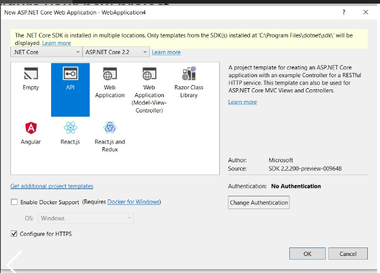
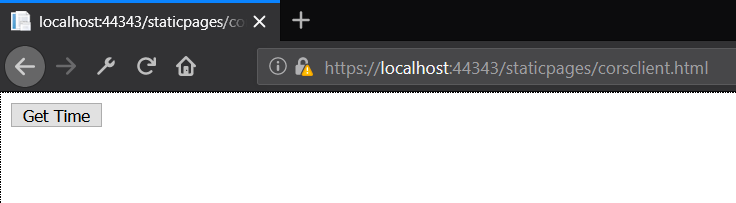

# What's CORS and Adding CORS support in ASP.Net Core

Do you want to understand CORS? Does it sound too complicated to understand? Are you building Microservices and worried about integrating with multiple frontend application?


Or have you encountered the above error, and never understood why the error happens? This article will provide an answer to the above-mentioned questions and will go into the details of what you need to understand/troubleshoot CORS Issue. In this article, we will also describe how to add the CORS support in the Asp.net core web API to enable multiple clients in a different domain to interact with the API. Later we will demonstrate an interaction between a static webpage accessing an API on a different origin.

## How Microservices are shaping the modern Application development

In modern software development, with the advent of the microservices and the rise of the Distributed applications, more components than ever before are being developed in isolation. The monolith applications are being architectured to build smaller more manageable components in the form of the Asp.net core web API. The microservices can be deployed and scaled independently of the frontend. Also, since the Frontend needs to communicate with the API, it is the API responsibility to ensure that it allows the clients to interact and send appropriate data to clients to enable secure communication.

## What is CORS?

CORS stands for CROSS ORIGIN RESOURCE SHARING

Cors is a **SECURITY** mechanism employed by the browsers like (Firefox, Chrome, IE etc.) to prevent the browsers from making calls to another Website.
A request for a resource (like an image or a font) outside of the origin is known as a cross-origin request. CORS (cross-origin resource sharing) manages cross-origin requests.

>*A more naive explanation - It's like the Security Guard which prevents a malicious person from entering your premises until they possess certain Authorization and hence keeps your family Safe.*

You are living in a secure Housing Apartment Community and having access to all the facilities and having a great time :). The access to the community is restricted to its tenants only to ensure safety. You have a **great swimming pool** and your friends want to come and enjoy the pool. If you are a tenant, then you can come in and come out at any time. However, if any person who is not a tenant tries to enter into community premises, she/he would be denied permission and wouldn't be able to access the swimming pool.

> You are thinking about a new year party in your community swimming pool and invited your friends. Since the access to the pool is only restricted to tenants, how would you sneak in your friends? In order for them to enter the apartment community, you need to establish a mechanism to allow your friends to come inside the Apartment Complex. One of the mechanism might be giving your friends some Unique Passes which the security would trust and allow access.

Above analogy was a simplistic explanation to understand the overall concept of the CORS. The notion of the security for a Housing apartment is similar to the security implemented by the browsers using the same origin policy. I will refer to this example later while explaining the CORS concept in this article.


Let's break the CORS into smaller pieces to understand it better.

#### Cross-Origin

Cross origin means that the origin of the request can be different from the domain that made the request. In Simple words, when a user browsing website X makes another request to website B, it is considered as Cross-Origin. We will understand later what exactly makes the request Cross Origin. 

In our analogy, Origin refers to tenant. 2 tenants are from the same Origin as they belong to the same Apartment Community.

#### Resource

A resource is like an Image, font, Videos, Data etc. When we are making an Ajax call, we are requesting for some data which is Resource as per the terminology.

In our analogy, swimming pool was the resource.

#### Sharing

CORS defines various headers which allows the browser and server to communicate about which requests are (and are not) allowed and enable the resources to be shared.

In our analogy, swimming pool was to be shared.

### What is an Origin?

Let's take a look at what exactly is Origin. An Origin is made up of the following three parts:

1. Protocol/Scheme : (Http/https)
2. Host : The server/domain name
3. Port number

#### Example of Same Origin

<https://galodha.com/image1.jpg>  
<https://galodha.com/image2.jpg>


#### Example of Different Origin

<https://galodha.com/image1.jpg>  
<http://galodha.com/image1.jpg>  (Different protocol)
<https://github.com/image1.jpg>  (different host)


### What is meant by Same Origin?

The same-origin policy is a security measure standardized among browsers. The "origin" mostly refers to a "domain". It prevents different origins from interacting with each other, to prevent attacks such as Cross Site Request Forgery.

The same-origin policy is very restrictive. This prevents JavaScript from making requests across domain boundaries. Although the same-origin policy is effective in preventing resources from different origins, it also prevents legitimate interactions between a server and clients of a known and trusted origin.

In our Analogy, we had a Secured Apartment Community which only allowed the tenants the access to the resources. Imagine if the access to the apartment resources is not restricted, a malicious person can enter the Community and damage the swimming pool or other resources.

#### Why browsers enforced Same-Origin Policy?

The same Origin policy was enforced in order to prevent security attacks like CSRF (Cross Request Forgery).

##### Example

If you are browsing a bank website and in another tab window while watching your favourite video, you have an advertisement, "You Win the  lottery", you are enticed by the ad and click the advertisement, it opens another window. The Adverstisement is a malicious website and has ajax code to send the money from your account to Malicious site owners account. 

`$.post('http://yourfavouriteBANK.com/transfer', { to: 'maliciousOwner', ammount: '10000000' })`,

 Without further security measures, this would work because authentication cookies from yourfavouriteBANK.com would be sent and authenticate you.

For more information, you may be able to read here..
<TODO : add the link>

Next, we will look how CORS allows to circumvent the Same origin policy while not compromising on the security.

## How CORS allows to bypass the Same-Origin Policy.

CORS specification provides a list of headers values which browser and server understand to ensure that the different Origin can share resources. Most of the headers are prefixed with 'Access-Control-Allow'. Few Examples are  shown below.
* `Access-Control-Allow-Origin`
* `Access-Control-Allow-Headers`
* `Access-Control-Allow-Methods`

The most important of these is `Access-Control-Allow-Origin`, Let's explore this header.

#### Access-Control-Allow-Origin

The Access-Control-Allow-Origin header allows servers to specify how their resources are shared with external domains. When a GET request is made to access a resource on Server A, Server A will respond with a value for the Access-Control-Allow-Origin header. The value of this header may be set to a particular domain (or list of domains), meaning that Server A will share its resources with that specific domain (or list of domains). For development, Many times, this value will be *, meaning that Server A will share the requested resources with any domain on the Internet.


## Pre-flight requests

If a request may have implications on user data, a simple request is insufficient. Instead, a preflight CORS request is sent in advance of the actual request to ensure that the actual request is safe to send. Preflight requests are appropriate when the actual request is any HTTP Method other than GET, POST, or HEAD or if a POST request's content type is anything other than application/x-www-form-urlencoded, multipart/form-data, or text/plain. Also, if the request contains any custom headers, then a preflight request is required.

The preflight request is essentially asking the server if it would allow the DELETE request, without actually sending the DELETE request

Preflight requests use the OPTIONS header. The preflight request is sent before the original request, hence the term "preflight." The purpose of the preflight request is to determine whether or not the original request is safe (for example, a DELETE request)

()[]

AngularJS 

TODO : Check if angular js always send the Preflight request or not..


###

## How CORS work?

## Demo Application

To demonstrate CORS policy in action, we need a Client (Web Page) and a Server (API). Both should be running on seperate Origin.
We have covered Origin earlier.

We will create a Server side API and a frontend client which will invoke the API.
The API is just returning the Current Server Date time and then UI refreshes the span with the latest date time.


## Demo Application Server - (Asp.net core)

1. If you already don't have a Asp.net core project in your solution, then Firstly add a new project as shown below.



2. We will add a DateTime Controller, which will have a Get operation which would return the current date time of the server.
   The code for the `DateController` is shown below.

```
    [Route("api/[controller]")]
    [ApiController]
    public class DateController : ControllerBase
    {
        // GET api/values
        [HttpGet]
        public ActionResult<DateTime> Get()
        {
            return DateTime.Now;
        }

    }
```

3. Let's test the Date controller's, Get Method, we will open the browser and browse to API Host address, which in mine machine is `https://localhost:5001/api/Date` and we can see the Current Server date time. Works perfectly. Neat..


Please note that the Server Address will depend on your configuration and can be updated.

Before adding the middleware, let's see how the response looks like if we try to call the API from a web page running on another domain. Let's create a simple Web page which we will host in an asp.net core website. 

## Demo Client - (HTML Page with JS)

To keep the demonstration simple, i will use a simple web page with javascript to call the API.



1. The web page has 2 controls a `Button` control to click and a `span` to show the output.

```
<!DOCTYPE html>
<html>
<head>
    <title>Sample CORS Client</title>
</head>
<body>
    <button type="button" onclick="getCurrentServerDateTime()">Get Time</button>
    <span id="currentServerDateTime"></span>
</body>
```

2. Let's wire up the javascript to call the API and see what response do we get. To keep it simple and avoid any dependencies, i am using the native `XMLHttpRequest` object to connect to the API.

We will get the API Url, which in our case is running at `https://localhost:5001`, then construct an `XMLHttpRequest`, set the properties and call the send method.


```
<script type="text/javascript">

    function getCurrentServerDateTime() {

        var apiUrl = "https://localhost:5001/api/Date";
        var xhr = new XMLHttpRequest();
        xhr.addEventListener("load", responseCompleted);
        xhr.open("GET", apiUrl);
        xhr.send();
    }

    function responseCompleted(eventData) {

    }

</script>
```

3. So far so good, we need to host the website in a different origin, so i would be creating another Asp.net core MVC project for hosting client side code (our web page created earlier). I would be adding the web page created above to the wwwroot folder which is the place for all the static content and allows to serve the content from the client side.

Let's peek a look into the solution explorer in visual studio to see how it looks.


4. Let's keep Rolling and test the web page interaction with the API.
 Go to visual studio, and change the solution properties to allow for multiple start up projects. This allows to launch both the client and Server projects with one click.

 


2. Asp.net supports the CORS Middleware which we can plugin into our request pipeline to add CORS support to our API. Let's see how to add CORS to our Asp.net core API. Add the Reference to package  `Microsoft.AspNetCore.Cors package` which provides the sup


We need to 
Inner Workings

Let’s have a look at the picture below. There is a client app (https://example.com) sending a GET request to a server app (https://example.net) for some resource:

Enabling CORS in ASP.NET Core

All modern browsers set the Origin header automatically, which indicates the domain of the site is making the request.

If the server allows Cross-origin requests from the Origin (https://example.com), it sets the Access-Control-Allow-Origin header with its value matching the origin header’s value from the request.

In other way, if the server doesn’t include this header, the request fails. The browser shall receive the response data, but this data shall not be accessible to the client.

## How to add CORS in Asp.net core

There are 3 steps to enable CORS in a server app:

    First of all, we need the Microsoft.AspNetCore.Cors package in our project. It should be already installed in our project via the Microsoft.AspNetCore.App package, which is created as soon as our project was created. But if for some reason, you can’t see that package in the Solution Explorer, go to Tools -> NuGet Package Manager -> Manage NuGet Packages for Solution. Search for Microsoft.AspNetCore.Cors and install the package.

    Next, we need to inject CORS into the Asp.net pipelines so that it can be used by the application. In Startup.cs class, let’s go to the ConfigureServices method and register CORS:

    Registering CORS
    
    	
```
    public void ConfigureServices(IServiceCollection services)
    {
          services.AddCors();
          services.AddMvc();
    }
```
    
    To enable CORS for our application, let’s add the CORS middleware to the HTTP request pipeline in the Configure method, just below the if-else statement. Let’s specify an URL from where the CORS requests are allowed when building the CORS policy. Here, we have given the Client URL:
    Allowing requests from the client
    	
``` 
    app.UseCors(builder =>
        builder.WithOrigins("http://localhost:55294"));
```

Let’s save our Server app and re-publish it to the App Service. Now let’s open the client app and click the Try button. We should see an HTML document retrieved from the server app:


## Sample Application

## Testing CORS is working and validating

## Configuring CORS Server

```
{
    services.AddCors(options =>
    {
        options.AddPolicy("AllowOrigin",
            builder => builder.WithOrigins("http://localhost:55294"));
    });
 
    services.AddMvc();
}
```

## Configuring CORS Client

If we only want to allow CORS requests to a selected few methods, instead of enabling CORS at the entire application level, we can also enable CORS at the controller level or at the action level.

### Configure CORS Policy Options

## How it actually works?
`

## Summary


## References