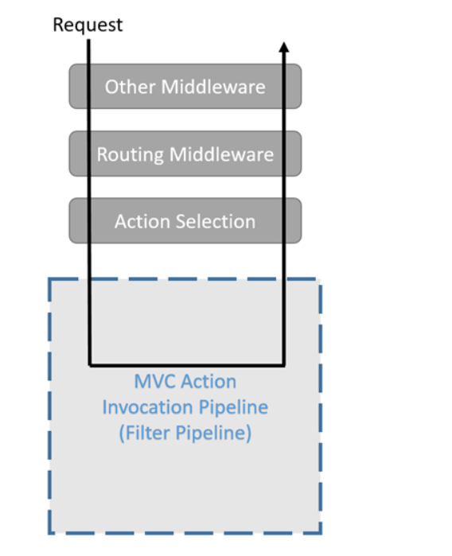

# Measuring and Reporting the Response time of an API (Asp.Net Core).

## Introduction
Performance is the buzz word for the API's. One of the most important and measurable parameters of the performance of an API is the Response time of the API. In this article, we will understand how to add code to measure the response time of the API and then return the Response time data to the end client.

## What is the need?
So, let's take a moment to think why we would ever need such a feature to measure the Response time of an API. 

Following are some of the points that have been inspiration for writing code to Capture response time.

1. You need to define the SLA (Service Level Agreements) for your API with your clients. The clients needs to understand how much time does the API takes to respond back. The response time data over the time, can help us decide an SLA for our API.

2. Management is interested in reports as to how fast or slow is the Application. You need to have data to corrobarate your claims. It is worth to have reports on the performance of the application and share with Stakeholders.

3. Client needs to have the information of the Response time of the API, so that they can track how much time is spent in client and the Server.

You might also have encountered similar requests in your project and it is worthwhile looking at an approach to capture the response time for the API.

## Where to add the code?
Let's explore a couple of approaches to capture the Response time of our API focusing mostly on capturing the time spent in our API. 
Our objective is to calculate the time elapsed in milliseconds from the time the request is recieved by the Asp.net core runtime to the time the response is processed and sent back from the Server.

### What factors are we ignoring?
It's important to understand that this discussion doesn't include the time spent in N/W, Time spent in IIS, and Application Pool Startup. If the application Pool wasn't up and running then the first request can affect the overall response time of the API. There are Application Initialization Module which we can make use of but that is out of scope for this article.

### First Attempt

One very naive approach to capture response time of an API would be to add code to every API method at start and end and then measure the delta to calculate the response time as shown below.

`// GET api/values/5
[HttpGet]
public IActionResult Get()
{
    // Start the watch
    var watch = new Stopwatch();
    watch.Start();
    
    // Your actual Business logic

    // End the watch
    watch.Stop();
    var responseTimeForCompleteRequest = watch.ElapsedMilliseconds;
}
` 

This code should be able to calculate the time spent in an operation. But this doesn't seem to be the right approach for the following reasons.
* If an API has lot of operations, then we need to add this code at multiple places which is not good for maintanability.
* This code measure the time spent in the method only, it doesn't measure the time spent in other activities like middleware, filters, Controller selection, action method selection, Model binding etc.

### Second Attempt
Let's try to improve the above code by centralizing the code in one place so that it is easier to maintain. We need to execute the response time calculation code before and after a method is getting executed. 
If you have worked with earlier versions of Asp.net Web API, you would be familiar with concepts of Filter. Filters allow you to run code before or after specific stages in the request processing pipeline.

We will implement a filter for calculating the Response time.

###### Image taken from docs.microsoft.com

This code still doesn't address the issue of calculating the time spent in execution of middleware, Controller selection, action method selection, Model binding etc. The The filter pipeline runs after the MVC selects the action to execute.

### Third Attempt
We will use the Asp.net Core Middleware to Calculate the Response time of the API. 

### So, What is a Middleware?
Basically, Middleware are software components which handles the Request/Response. 
Middleware are assembled into an application pipeline and serves in the incoming request. Each component does the following operations.
	• Chooses whether to pass the request to the next component in the pipeline.
	• Can perform work before and after the next component in the pipeline is invoked.

If you have worked with `HTTPModules` or `HTTPHandlers` in Asp.net, then you can think of Middleware as a replacement in Asp.net core. Some of the examples of middleware are
* MVC Middleware
* Authentication
* Static File Serving
* Caching
* CORS

We want to add code to start the timer once the Request Enters the Asp.net core pipeline and stop the timer once the Response is processed by the Pipeline. A Custom Middleware at the start of the request pipeline seems to be the best approach for getting the access to the request as early as possible and access till the last step is executed in the pipeline.

We will build a Response Time Middleware which we will add as the first Middleware to the request Pipeline so that we can start the timer as soon the request enters the Asp.net core pipeline.

## What to do with the Response time data?
Once we capture the response time data we can process data in following ways
1. Add the Response time data to a Reporting database or an analytics solution.
2. Write the Response time data to a log file.
3. Pass the response time data to a message queue which can further be processed by another application for reporting and analytics.
4. Send the Response time information to the client applications consuming our Rest API using the Response headers.

There may be other useful ways of using the response time data. Please leave a comment and tell how you process the response time data in your application.

## Let's write the code
We will write the code considering following points
1. Calcuating the Response time data for the API
2. Reporting the data back to client applications by passing the data in the Response headers.

Full code snippet for the ResponseTimeMiddleware is shown below.

`
public class ResponseTimeMiddleware
    {
        // Name of the Response Header, Custom Headers starts with "X-"
        private const string RESPONSE_HEADER_RESPONSE_TIME = "X-Response-Time-ms";
        
        // Handle to the next Middleware in the pipeline
        private readonly RequestDelegate _next;

        public ResponseTimeMiddleware(RequestDelegate next)
        {
            _next = next;
        }

        public Task InvokeAsync(HttpContext context)
        {
            // Start the Timer using Stopwatch
            var watch = new Stopwatch();
            watch.Start();

            context.Response.OnStarting(() => 
            {
                // Stop the timer information and calculate the time
                watch.Stop();
                var responseTimeForCompleteRequest = watch.ElapsedMilliseconds;

                // Add the Response time information in the Response headers.
                context.Response.Headers[RESPONSE_HEADER_RESPONSE_TIME] =  responseTimeForCompleteRequest.ToString(); 
                return Task.CompletedTask;
            });

            // Call the next delegate/middleware in the pipeline
            return this._next(context);
        }
    }

### Explanation of the code
The interesting part happens in the `InvokeAsync` method, We use `Stopwatch` class to start the stopwatch once the requests enters into the first middleware of the request and then Stop the Stopwatch once the Request has been processed and the response is ready to be sent back to the client.

?? We use the OnStarting Method, Passing an action where we define what needs to happen once the response is ready to be sent to the client.

Lastly, we add the Response time information in a Custom Header. We use the `X-Response-Time-ms` header as a Response Header. As a convention, the Custom Header start with an`X`.

## Conclusion
In this article, we understood how to leverage Asp.net middleware to manage cross cutting concerns like measuring response time of the API's. There are various other useful use cases of using middleware which can helps use reuse code and improve the maintainability of the Application.

## References
https://docs.microsoft.com/en-us/aspnet/core/mvc/controllers/filters?view=aspnetcore-2.1
