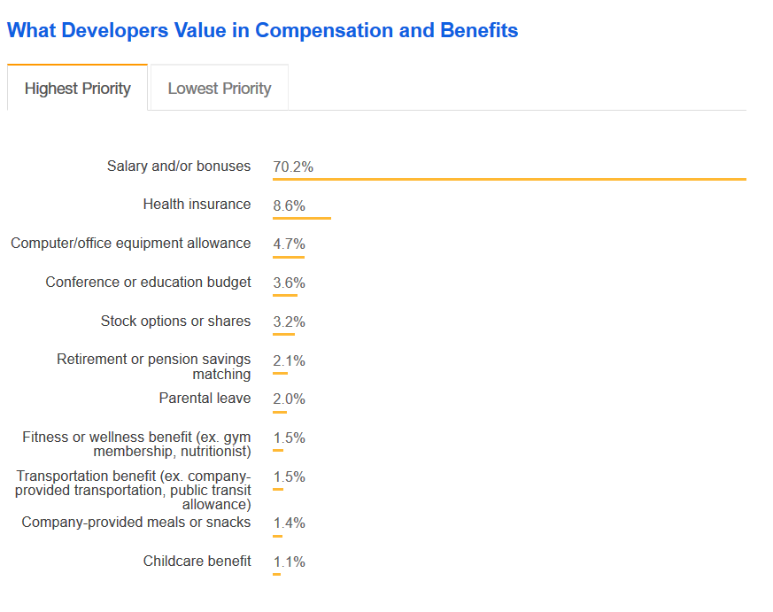
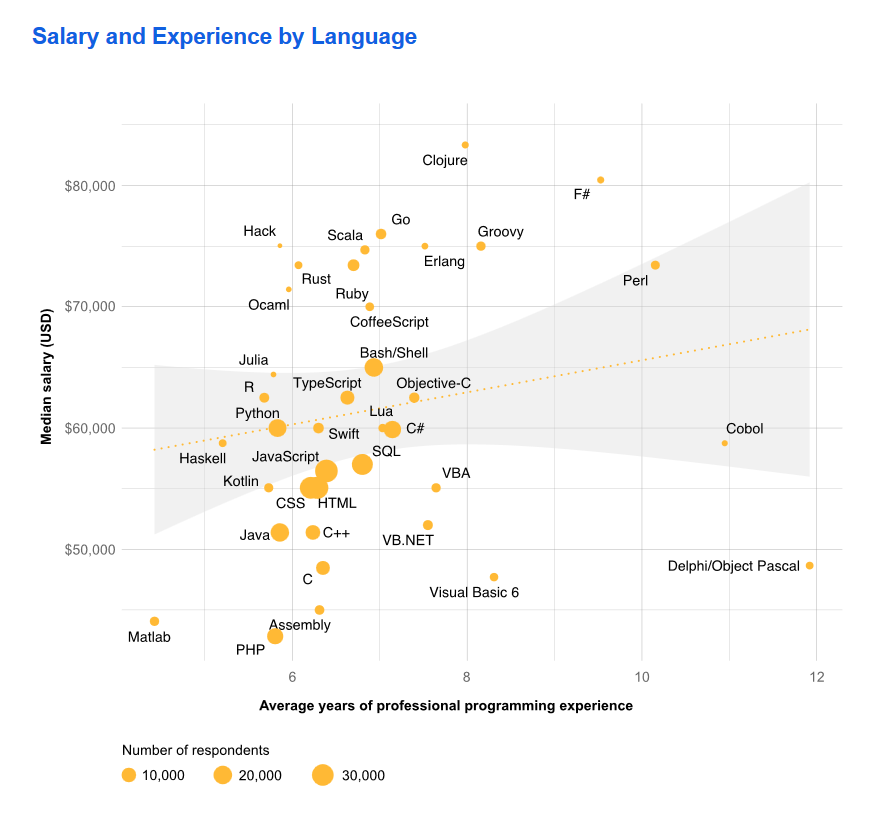

# Salary Negotiation

## Why is it important?

Stack overflow survey results - the importance of the salary as #1 factor in the Job Satisfaction. If you are employed or looking to get employment, it is imperative to have good negotiation Skills and when it comes to Salary it can be complicated. We might be unsure about the Salary range and what's are the things that can screw your negotiation. In this post, we will look at few of the negotiation skills which i have found useful and may be beneficial to you as well.You’re nearing the end of the job interview process and an offer is in sight. A key ingredient of salary negotiation is good communication. We need to be clear with our intentions and communications to avoid ambiguity, which could complicate things and yield undesirable results.

## Do i need a Salary Raise?

There may be myriad reasons for the Salary Raise. Are you preparing for the Next annual Review meeting with your manager. Some of the possible reasons that i can think of are mentioned below.

* Annual Increment is pending.
* You might be Joining a new company.
* Not satisfied with the current salary and need to ask for a raise.
* If you have another offer, then best time to Negotiate.

## Yes, I need a Salary Raise, what's next?

Foremost, do your homework and make a plan and understand **Do's** and **Don't**  and other considerations which can help in getting the best deal. Also, bear in mind following points as you prepare yourselve.

<TODO - Introspection Gif>

* Start with Self. Introspect and take a look at what you are currently doing and what you want to do in near future. Do the SWOT (Strength, Weakness, Oppurtunities and Threat) analysis, question yourselve and make an honest assessment of your skills and the value addition that your bring into the company.
* Find out a Salary range which is acceptable to you.
* Other than Salary, what other benefits can you consider and prioritize benefits as per your liking.

Finally, It's never too late. It better to ask for a raise than just wondering about it.

## How much do you deserve?

Other than doing your own self assessment, it is imperative to look at the external resources to Collobaorate your findings.

* Analyze the *Specific Position* in your *Area* and how much salary is offered for that *particular Role*. Get the concrete information Like a Asp.net Web API developer with 5 Year of Experience Earns XXX amount at particular *location*. **Position, Role, Years of Experience, Technology Demand, your Skillset and Location** are keywords. The salary will vary depending on these factors. If you move to an expensive location, you will need a higher salary. Go into a negotiation with facts and figures, making a compelling case. Following is an link from Stackoverflow, which shows the Salary Range in US depending on the Language and Years of Experience. 

Image from here https://insights.stackoverflow.com/survey/2018#salary

* There are valuable resources online to calculate and compare the salary based on above factors. Use sources like GlassDoor, Payscale, Stackoverflow Salary Calculator to get the Salary estimates. These website would let you gauge the salary limits depending on number of factors. Also, the salaries are reported by actual employess. So, the Salary numbers are pretty accurate. Don't stick to these numbers, these are just guiding figures to help you figure out what the market currently offers for the specific position and you may adjust your salary expectations.

TODO : Screenshot for Stackoverflow or Glassdoor and include links

TODO: Example of salary of .net developer in India - Delhi, Chicago etc.

* Analyze how much the company that you are working/expected to join pays for that specific Position.

* Also, take a look at how the company is doing. If they have made profit over last year, then probably a good time to ask for raise. If it has loss, lay off, then probably not a good time. Assess the conditions of a company and then prepare accordingly.

## Things to do before negotiation

> Rather than panic in the moment, be prepared.

* Know more about the decision maker. Research about them, use Social media/Linkedin to get information about their profile, what kind of work they have done and what kind of colleagues they work with. This knowledge about them would help you in conversation with them.

* Think what Hiring Manager is interested in and why they might be asking a question. Not just think about answering a question. Their might be a covert reason for asking the question. Try figuring those Covert reasons and mold your answer accordingly.

* Everyone has a different viewpoint. Understand the person you are talking to and analyze and adapt. HR manager might have one view, but your manager might have different view for the same issue. Try to work with different personalities. If you have a niche skill, you might be easily able to explain to your manager about the skill and link with salary increase than talking with an HR Manager.

* Be prepared for tough questions. Don't wish and pray that Hiring Manager wouldn't ask that Tough question which you are not able to answer. Take your time and prepare for the tough questions. You might have some years of Gap between Completion of Education and Employment. Think and prepare how you can explain this to Hiring Manager. List all the questions that make you uncomfortable and try to get answers and be prepared to answer those questions. Do you don't have offers during summer internship? So, don't be thinking that Hiring Manager will not ask, but rather prepare. The hiring manager throws some difficult questions, and if you are not able to handle it gracefully, you will be be loosing the plot.

An example from Mike Tyson from youtube video...

* Mike Tyson - Everyone has a plan until they are punched in the face… Similary, during negotiation process, all is looking well you have prepared everything, until 

## What should I keep in mind during negotiation?

* **Stay Calm, Polite and respectful.** Easy to say, but difficult to do, this will not happen in a day but you need imbibe calmness in yourselve and it will take time. Try Meditation or any other thing which helps you keep calm.

* Look at the entire deal and the bigger picture. Fixed Salary might be the most important thing, but don't ignore other things like Yearly Bonus, Equity, Insurance Coverage, Travel allowance, work environment etc. Look at the entire package and don't be narrow minded and worrry about the fixed Salary.Other benefits should be considered while considering the overall Salary Negotiation. You might get a better overall deal while still getting a lower Fixed salary as per your expectations.

* Hiring Managers might have constraints, try to understand those but don't go in the details like why the Salary is fixed for a employee at a particular Grade/Band/Level. They might not be able to share the data with you.

* Present all your Priorities together in one meeting. Don't come up with new demands in every meeting. It can be irritating for the hiring manager and they might think that you are not clear and confused.   
I have made this mistake. In the first meeting, i mentioned that I need X salary, in next meeting again told the hiring manager that i need X+Y salary and in next meeting when they were ready to offer X+Y Salary, i demanded another benefit. As you might be able to imagine this didn't go well and i didn't get all i desired. The learning for me was clear that i need to be better prepared and think about Salary and all benefits before first meeting and present them together.

* Don't haggle/fight for every small thing, this will make them dislike you.

* When someone says "No" in a negotiation. It means that at that point in time the answer was "No". But, it may change at some time in future. It might change in 3 months from now on, the situation might be different in future and what they were not able to offer 3 months ago, they might be able to offer you now.

* Form your request as a question not as a directive. 

* Give yourself a way to accept offer. Think about what you can compromise on and accept the offer. Don't be rigid and be flexible and open to alternative form of compensations or other give yourself other options. Don't assume that you will get everything you want, be flexible and open for various options.

* Focus on the company’s needs and how you can help meet those needs so they can easily see your value and work to compensate you for it. Can you help a company adopting or providing solutions for new age technology.

* Stay at the table - Stay in touch. Things change and circumstances can alter which may mean that something which was not possible earlier, might be possible now. If you can't make a negotiation at this point, try in near future and check back how things are in future.

## Don't in Negotiation

> Never Lie in the Nogiation.

* Don't lie in a negotiation. Never, Never, Never Lie in a Negotiation. Hiring manager have experience and are smarter than you think, they might be able to catch your lies and if it happens than you would loose trust and wouldn't get favourable deal.

* Compare your salary to some of your Colleague. This is the most common thing that happens in the industry. We tend to compare our salary with other colleagues and demand that we get similar salary. There are lot of factors that decide the salary and you might not have best idea about all the reasons that other colleagues are getting better salary. So, it is best to avoid salary comparisons with other colleagues.

* Don't list your family responsibilities as one of the reason for Salary increase. You might be the sole earner in family and you need to manage your family, most of us can relate to it but it's very difficult for hiring manager to raise your salary based on emotional issues. However, you may talk about the inflation, rent and other expenses which have a direct affect on your effective value of salary. Be prepared with concrete numbers for the data about inflation and other costs if you need to discuss.

* Don't complain. A positive approach as to why you deserve a raise will get you more than a complaining against co-workers you feel are overpaid or aren't performing as well as you are. Also, don't complain about external factors which is stoping you from doing your Job, but provide solutions to those problems and ask your manager for any help in implementing those solutions. 

* Try to use the positive words instead of using the negative words. Minimize the usage of negative words. Instead, replace and rephrase your sentences with positive phrases. 

-Ve: “No, I don't know about..” (2 negative words)

+Ve: “I didn't get a chance to work.. and i am willing to work..

-Ve: “No, that doesn’t work for me”

+Ve: “I would be more comfortable with” (positive words). 

This will take some time and practise.

* Don't give a Salary Range. Because employer would go for a lower range. Also, give the hiring manager that you are not sure what you want..

* Instead of asking for “more” salary or “more” vacation, this is your time to get specific.
Quote from FastCompany article
“Don’t leave things to the imagination once you’re negotiating. Instead of “Could you budge on the salary?” say, ‘I would be more comfortable with a base salary of $105,000.'”

* No matter how many times you rehearse what to say, there’s always that risk of fumbling right at the five-yard line. Instead of panicking, get prepared.

* Don't accept or make ultimatums. 

## What to do if the Salary is fixed (Non-Negotiable)? What are other options to consider?

Let's accept it, certain time the Hiring manager has to abide by the policies and procedures and can't offer the salary beyond a certain limit. What should you do in such situations? Be flexible and look at the bigger picture and try to substiture the salary for other perks. Following are some of the ways which you can provides you with other choices when the salary is fixed.

* Take Equity if Base Pay is fixed. Check if company can offer certain shares of the company which can be beneficial and will be a monitery benefit.

TODO: Check data for shares for equity.

* Get a good deal with Health Insurance. In certain countries like USA, the cost of health insurance is high and if you can get a better deal with Health insurance it would save you certain money. Try to reduce your contribution and get more contribution from the employer.

* Certain companies also allow for travel allowance by paying for Train, Bus and Commuting costs. In one of my previous companies, we used to get free commute.

* Explore about other Additional Benefits and perks such as
	* Kids Day Care and expenses
	* Meal Expenses
	* Internet and phone expenses
	* Lease Breakage and Relocation
	* Education paid options like nanodegree or executive programs.
    
TODO - Are there any other expenses which can be added?
	

* Negotiate for things which they can give us in the future. Like 6 months, 1 year, e.g. bonus after completion of 1 year. If you are doing well, can they look at revisiting the salary in the next 6 months instead of an year? It's imperative to understand that they might not be able to give you something today, but might be able to accomodate in the future.

* Check with your manager have they ever compensated other employees in different ways for salary hike, what has been other mediums? You might open an oppurtunity for getting compensation in another way which has already been done in the past.
 
* You might have technical inclination for doing a specific set of work. As an example, currently, i am more interested in working in Asp.net core. So, I may ask for an oppurtunity to work on a similar project. If you get a work which can you find solace then it would be great and you will find peace.

* Explore options of flexibility in Location and working from home. If you have family and kids, it is good to avoid commute and save time and spend quality time with family.

* If you like travel, you may ask for more travel oppurtunities and travel and see new places while doing your your work assignments.

* You can also try to get yourself sponsored for conference/training/seminars. You can try for sponsorship to Microsoft events like Build event, Ignite, Google I/O, Facebook etc.

## How do I get more? How to ask for Higher Salary?

If your salary is in the range for similar jobs in the industry, that's going to be a ceiling on any salary increase. If you're already making more than the competition, then you have some work ahead of you to justify that raise you want, so read on.

> Make them like you. The more they like you. The more chances of raise.

* One very simple way to increase your chances of favourable raise is to make them like you more. The reason that they are offering you a Job is because they liked you and you fit into the Role Perfectly. If they like you more they might be able to offer more. Give them the reasons to like you more.

* You might want to push for a one-time bonus or other variable compensation rather than a straight annual increase.

* Communicate your achievements. During interview, they might not have time to go through your resume line by line and in detail and might not be knowing a lot of things about you. You may talk to them about your achievements and how your past achievements would help you in your current Role and the value addition it brings.

If you are already in a company then try the following.

* Talk about the **value** that you bring into the Company. What actions have you done recently or in the past which increases your worth. Some of the examples are mentioned below.
 	* Did you saved time and money by automating a process?
 	* Did you in any capacity done anything to increase productivity?
 	* If you can relate any work to the money/reputation, it is easy to convince your Boss. For e.g. You automated the Deployment and thus saved 30 mins of daily time in the Deployment Task. That's effectively a saving of 7560 minutes (considering 252 working days) that would ultimately mean a saving of certain Currency. it's good to relate to Monetary benefit of your work as it is easier to talk to managers abou the concrete numbers.

* Have you taken additional Responsibilities. You might have been working on an additional Project or helping another team as being the single point of contact for your team. Being a developer, you might be taking additional responsibility in talking to Business owners and helping with requirement gathering. Make a note of additional Responsibilities, convey to your supervisor and check if that stands a reason for an additional increment.

* Have you completed a successful project? Throughout the year, keep a track of your accomplishments and remind your manager about the successful projects and deliverables you have helped the company. E.g. As a developer, you might have deployed the first Microservices in your Group/Company.

* If your duties have changed, remind your boss. Even better, put a figure on the savings or gain to the employer from your additional work and make your raise reflect a reasonable percentage of that savings. Some examples are shown below
	* You are leading/involved in more than 1 projects which was originally allocated to you.
	* You have been involved in Interview and selecting candidates.
	* You have been Supervising more people than previously.

* Record milestone. Most importantly, tie your performance to an increase in sales, revenue, or better yet, profit for your employer. While your hard work should be rewarded, it's a lot easier for your boss to give you $3,000 or $5,000 more if you've actively contributed to a bump in revenue of, say, $50,000.

## Better Salary in Long term

Rome wasn't built in a single day. Similarly, you might not be able to get a great salary today, but you can prepare yourselve and find a better deal in future by proper preparation and understanding what it takes to be the Most valuable person in the team.

* Foremost, Sharpen the saw.. Invest in yourself, Become a better individual. Learn from your mistakes, prioritize the right tasks and spend more time on important tasks and less on Urgent work. 

### Introspection

Remember that working hard or working long hours is not the be all and end all for an increase in salary. If it takes you longer to do something than it takes your peers, you're not likely to get a raise for that. Similarly, if your work process is inefficient, resulting in a lot of effort for the same result, that's probably not going to get you a raise. Improving that process or improving your performance may.

* Be a doer. Don't profess and boast about things you can do, always better to show the results. Be an executor and finish the things you undertake.

TODO: AAmir sohail vide..

* Create things rather than doing the rot. Don't be stuck in things which are mundane and boring. Try and experiment with new ideas and see how your company can benefit from those ideas. Be innovative and solve the problems.

* Understand the priority, direction and align to the goals of your Manager and comapnies. 

TODO : example

* Make sure your boss and other key personnel understand when the reason things are "running smoothly" is you. This is an ongoing process. In other words, you need to constantly remind them when you contribute to a major success or preempt a significant problem. Be prepared to summarize those achievements when you talk about your raise.

	
* It's not always easy to know how much you contribute to the bottom line, and it's certainly easier in some jobs than in others. A sales representative can typically point at monthly reports to justify a bump in salary, but other workers have to be more creative. For example, a bartender may know that the till at the end of his shift is a lot higher than at the end of someone else's, or an auditor might complete audits on average faster and with less client pushback than her colleagues. Whatever measure you use, try to come up with a reasonably objective measure of your performance (and value to the employer) in any discussion about compensation.

## Tata Sky - Mangne me kya jata hai..

## Disclaimer

I hope you had a good time reading this article. This might not necessarily work for everyone. There are so many different people, culture and it varies. 

	
## Do i need to provide an Immediate Response?

Did the hiring manager made an offer/salary figures and need your response now? Don't rush, take your time, think about it and consult your friends and family if need arise. You may say something like re, "l understand. However, I'm not sure I'm ready to walk away with the salary offered. So, I'd like to sleep on this and call you tomorrow morning with an answer." 

## What about No Deal

Sometime, the offer might not just work and might not be meeting your criteria. It's hard, but It's ok to walk away from the deal. If you have decided that you wouldn't be able to accept the offer then you may something like "I understand and I really do appreciate the time  and effort you put into considering me but I'll have to  decline the offer." 

## Final Note

* Be happy
* Content  - How much people earning.
* Enjoy the journey.
* It's not all about salary.
* Look for a change…

Instead, try something like :

    I’m not comfortable sharing my current salary. I would prefer to focus on the value I can add to this company rather than what I’m paid at my current job. I don’t have a specific number in mind for a desired salary, and you know better than I do what value my skill set and experience could bring to your company. I want this move to be a big step forward for me in terms of both responsibility and compensation.

### Todo

1. Images and Mimes
2. Stack overflow developer survey results for Salary.

## it is process

## Things to Do

## Prep work

## Don't

## Next Steps

## How i got

## Also find about these
* What are the things that they are expecting from me, what kind of contributions can I make..

* What is future in this Role and What kind of various Roles are available for my profile currently and in the future. Are there any other Roles then the Delivery Specialist, Just want to get a sense of the various Roles available

* Different Designation? Solution Architect/Sr. Developer..
* When is the next Increment due?
* I would be interested to know the Annual % increase in Salary. 
* Green Card Process (E1B) - Can it be upgraded?
* Are there any other form of compensation which you have provided in the past which are unusual.
	○ Housing subsidy
	○ Train/Commute
	○ Meal Expenses
	○ Stocks
	○ Bonus
	○ Any health plans which have less premium
	○ Training
	○ Conference (Tech)
	○ Lease Breakage and Relocation..
	○ Day Care & Child Care
	
* Education paid options like nanodegree..
* Possible to review the salary again, later?
* Additional opportunities to earn like project/interview?

References:
https://www.fastcompany.com/90246630/what-not-to-say-in-a-salary-negotiation

https://www.glassdoor.com/Salaries/know-your-worth.htm?utm_source=referral&utm_medium=FastCo

