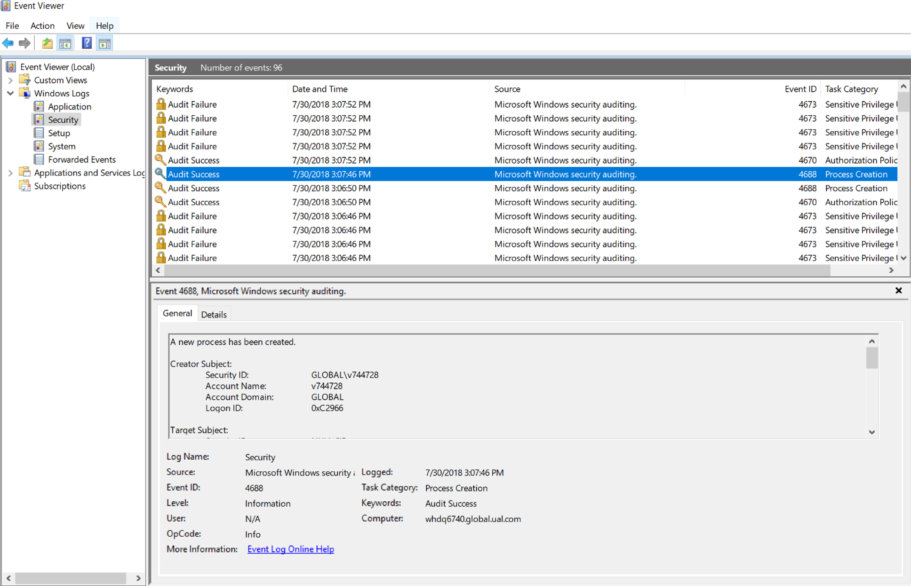
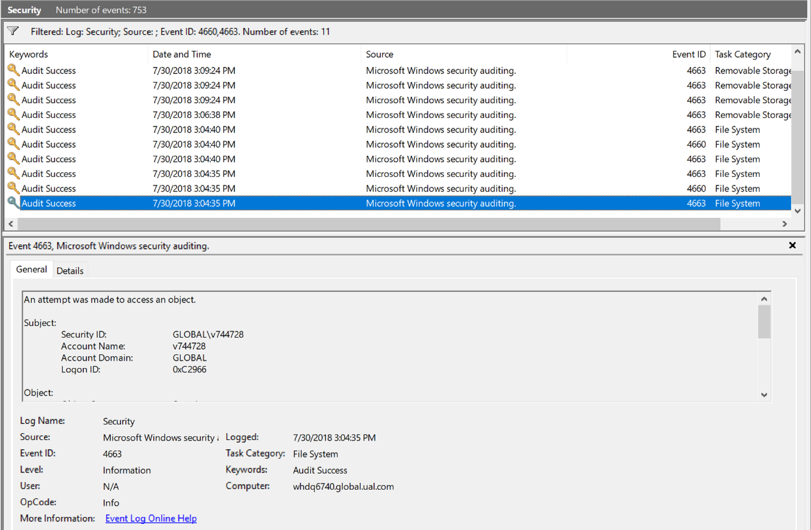
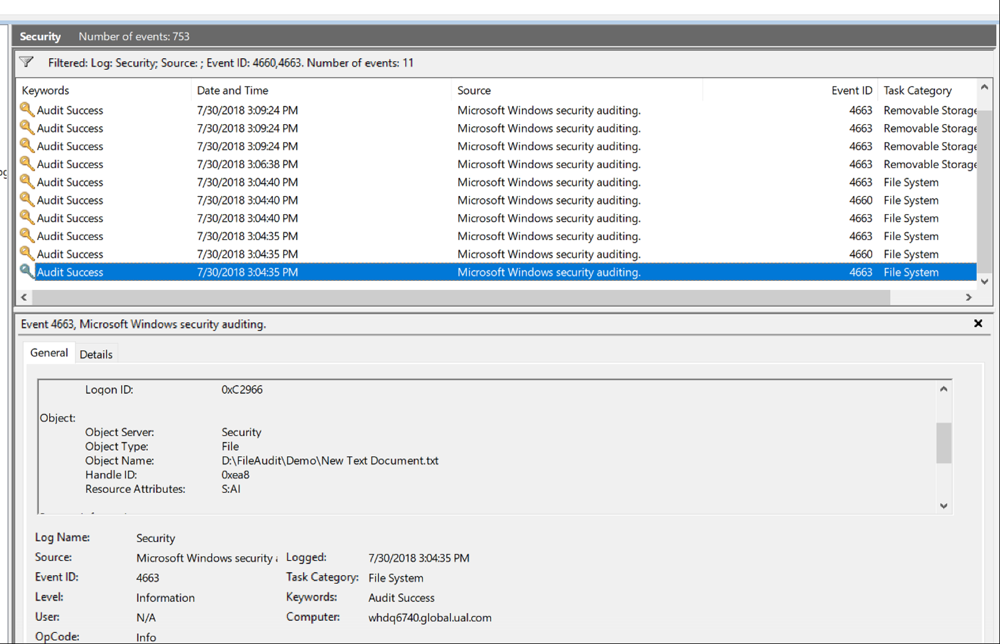
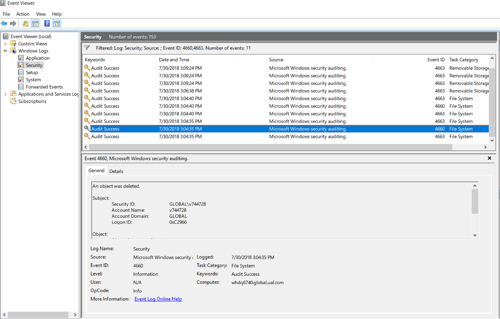
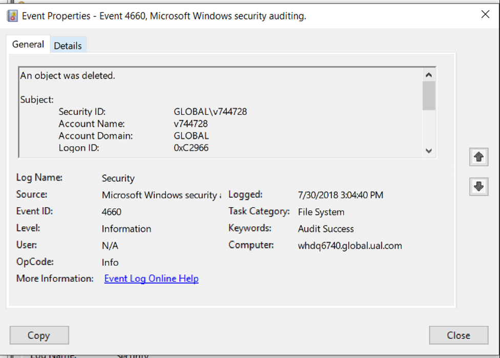
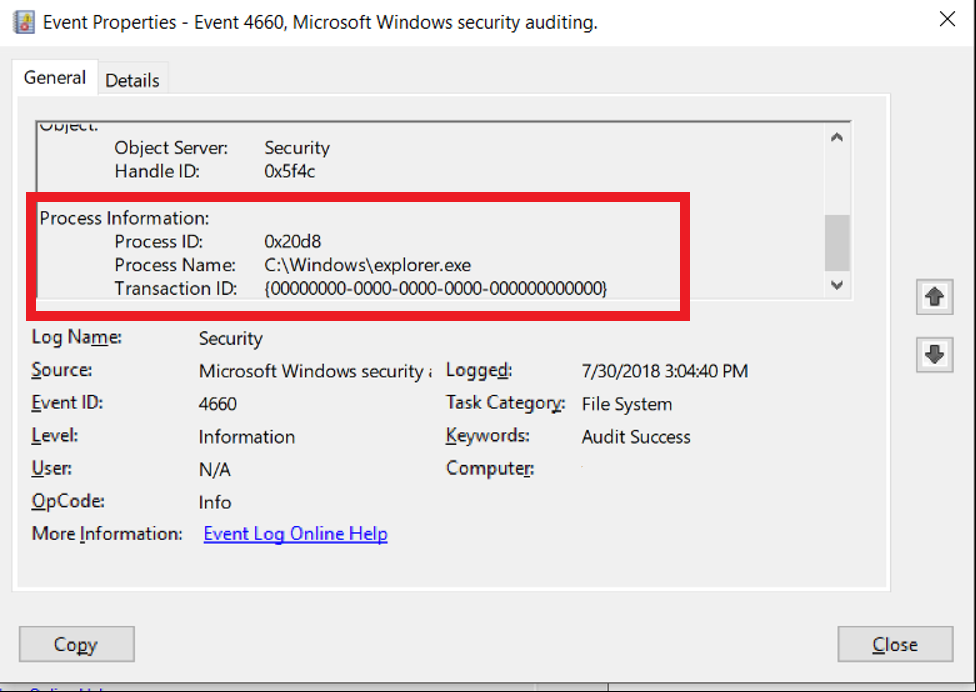

# Who deleted the file?
Have you ever experienced a scenario, where a file has been deleted from a machine and you are wondering who deleted the file and had no idea who was the culprit? Good Luck! In this article, I will try to explain a technique available on the windows machine to find out who deleted the file.

## Motivation
The urge for writing this article comes from an issue in our production environment and it might be useful for readers if ever they encounter such an issue. Our problem started when one of our production servers went out of the load balancer. We had recently deployed an Asp.net core 2.x application, which was deployed as a Self-contained Application. In a self-contained deployment, the complete .net core framework is bundled in a folder and it also includes your asp.net core Exe which is launched by the IIS server. In our scenario, the exe was being deleted which was causing 502.5 process error as the Host Process couldn't be started. Since the production server has restricted access, it wasn't possible that a user is deleting the file. It was a sporadic delete operation and happened on some servers while others were working fine. This was the inspiration for identifying how the exe was getting deleted.

If you couldn't follow with the above reasoning, you may be able to possibly relate with the following scenario where the need to find out who deleted the file is important?

* A Shared folder among the team has certain files deleted.
* The deployed application is missing certain files.

## What Windows OS offers?
Windows offers the built-in Audit features using various Policies which allows to Audit the access requests, Audit login, Process tracking etc. 

# How to know who deleted the file?
The following 3 step process would help us in identifying who deleted the file.
1. Turn on the File Auditing Process on the System.
2. Configure the Audit process on the File/Folder to be monitored.
3. Verify the Audit Logs to get details of who deleted the file.

**Note:** You will require the Admin permissions on the machine where the File Auditing needs to be set up.

Let's dig into these steps further in detail.

## 1. Turn on the File Auditing Process on the System.
Operating Systems offers the functionality to track various file operations. These features are configurable and can be turned Off/On using Policies. Windows uses the concepts of Policies to manage various settings which influence what can be done on the machine.

Wikipedia defines the Group Policy as

> Group Policy is a feature of the Microsoft Windows NT family of operating systems that controls the working environment of user accounts and computer accounts. 

There are Group Policies which applies to all computers in a domain and Local Policies applies to the local computer only. Group Policies are configured by Network admins. In this instance, we are going to change the Local Policy. Please note that windows Policies wouldn't work for Windows Home edition. You need to have a professional or enterprise edition of Windows.

a. Navigate to the System which needs monitoring and opens the Local Group Policy Editor by either entering `gpedit.msc` in the Run menu or typing in Group Policy in the Windows Search.

The Local Group Policy will appear as shown below.  

b. Select the Object Access Section on the left tree, by navigating to `Computer Configuration -> Windows Settings -> Security Settings -> Advanced Audit Policy Configuration -> System Audit Policies -Local Group Policy Object -> Object Access`

c. Select the Subcategory for `Audit File System`, and then right click or double click on the subcategory. Another windows pops-up, `Audit File System Properties`. Check the Checkboxes for the Success and Failure conditions under the `Condition the following event for checkbox as shown below`.

With the above-mentioned steps, we have enabled the File System Auditing on the Operating System. Next, we will explore how to set up logging for the Folder which needs to be monitored.

## 2. Configure the Audit process on the File/Folder to be monitored.
Basically, in this step, we will define *what* kind of File System Access (Read/Write/Delete) needs to be monitored and *what* Users & Roles need to be tracked.

a. Select the folder in the windows explorer which needs to be monitored for the file deletion.

b. Right click on the folder, go to properties, Navigate to **Security** Tab and then click on the Advanced button as shown below.

c. A dialog named *Advanced Security Settings for <YourFolderName> * would open. Go to Auditing Tab, and then click Continue. 
Note: You must be an administrator to define the Auditing policy.

d. Next, add the Audit entry by clicking the Add Button as shown below. This will open up another dialog for adding the Auditing entry.

e. Define *who* or which user should be monitored by entering the information in the principal. Since we are trying to find out who deleted the file, we will add **Everyone**. 

> **Everyone** is the name of the special group in windows which includes almost all users.

f. Next, Select the Type drop-down, We may select **Success** only for a successful file deletion operation or select **All** if we want to monitor a Success along with the failure operation. 

Also, select what permissions need to be audited. Since we are looking for the Delete operation, we need to click on the Show `Advanced Permission` link and then select `Delete & Delete Subfolders and Files` checkbox and click **Ok** button as shown below.

g. Once we complete the above step, the Audit Entry should include an entry to Audit an attempt to delete a file by Anyone on the Machine.
Click Apply and close the Dialog.

## 3. Verify the Audit Logs to get details of who deleted the file.
We have set up the Audit policy on the Operating System and the Folder in the above steps. Now, it's the time for Action. The File Audit policy would monitor and once the file is deleted from the Folder an entry is logged into the Event Viewer. Following steps would provide more details on how to find the entry in the Event Viewer.

For demonstration purpose, I would be deleting few files under the folder `D:\FileAudit\Demo`

a. Open the event viewer. 
> `eventvwr.msc` is the shortcut command for launching event viewer from the run menu.

b. All the File Audit entries would be logged to the **Security** Log. So, navigate to the Security log as shown below.

c. Since there are a lot of events in the Security log and we are only interested in file deletion we will filter the event viewer log by the event ID. Right click on the "Security" Log on the left tree and select filter log. A new dialog window would open as shown below. Enter the Event ID 4660 & 4663 to filter. This helps us narrow down the results in the event viewer and we can look for relevant information.

### What are Event ID 4660 and 4663
4660 - This event generates when an object was deleted.
4663 - This event indicates that a specific operation was performed on an object. 

d. We can click on a Row in the event viewer and get the detail in the Preview pane as shown below.
Below event shows the event 4663, which details who accessed the object. We can see user Abhinav tried to access the file. Additional details like time and access result (success/failure) are also mentioned.

We can also see the Object name as shown in below screenshot which was accessed. The file at location `D:\FileAudit\Demo\New Text Document.txt` was accessed.

e. Next, we will move to event 4060 which is the event we are actually interested in and is related to the deletion of the file. As can be seen in below screenshot, the details of the Event describes **An object was deleted.** and the Subject details provides who deleted the file. Account name and Account domain provides the relevant information and helps in identifying the culprit.

We can get more details of the event by double-clicking the event. In the following screenshot, we can see that the `windows explorer` process was used to delete the File by User `Abhinav Galodha`.

So, finally, we tracked who deleted the file.

## Conclusion
This article provides a technique to add the File Auditing on the machine and then steps to identify the user who  deleted the file. This technique can be extended to the similar scenario like "Who has made an unsuccessful attempt to delete a file". Also, there are various other file permissions which can be audited. Additionally, we can attach the task to an event ID. As an example, we can add a task to send the email whenever we see the file has been deleted. The event viewer is a handy tool to gather information on the System.

