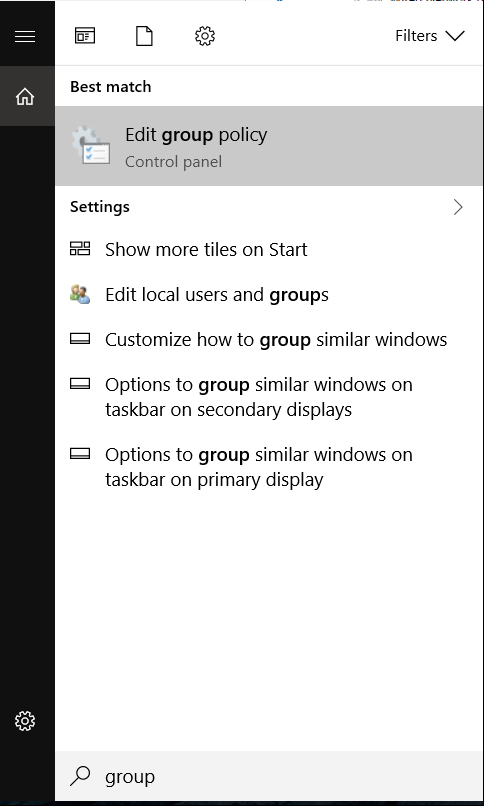
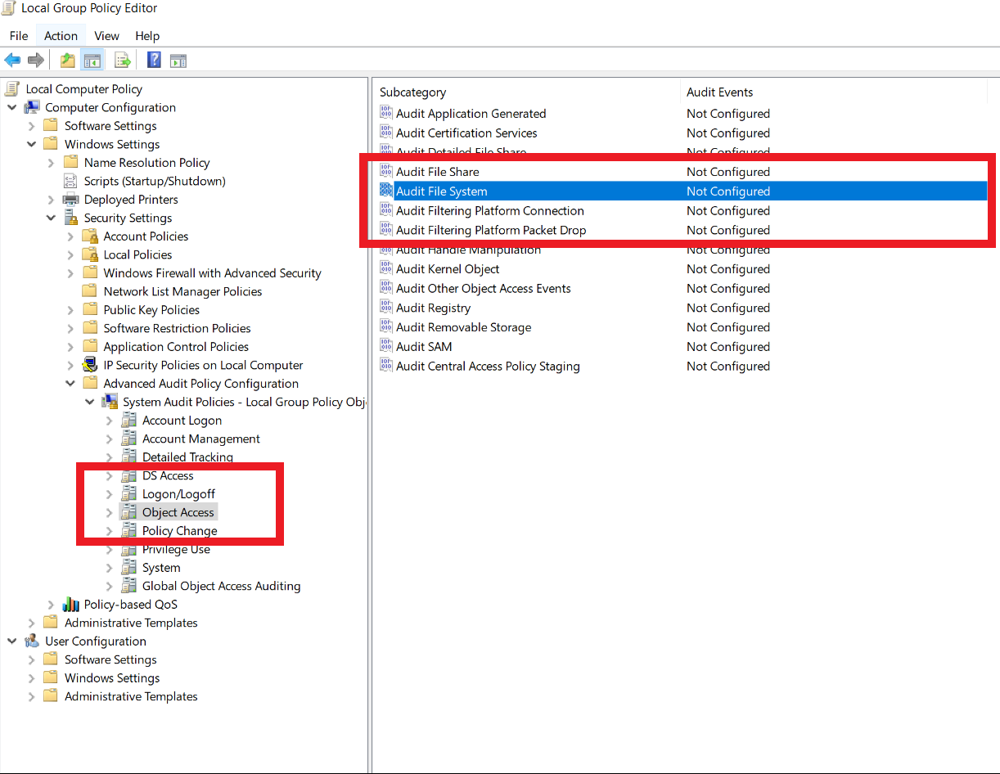
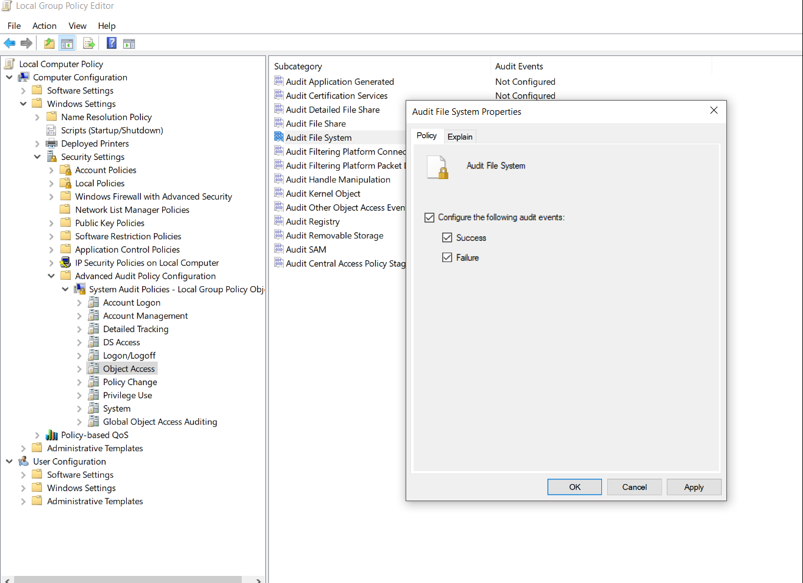
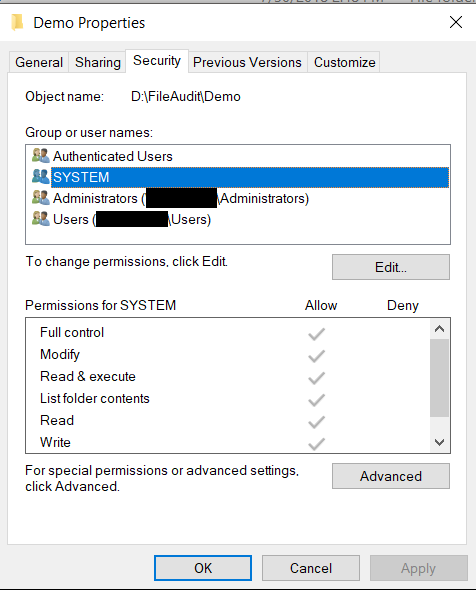
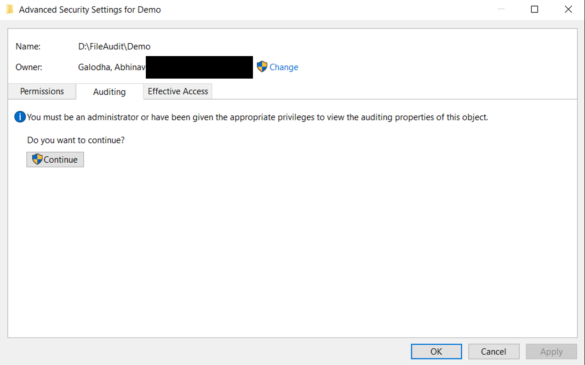
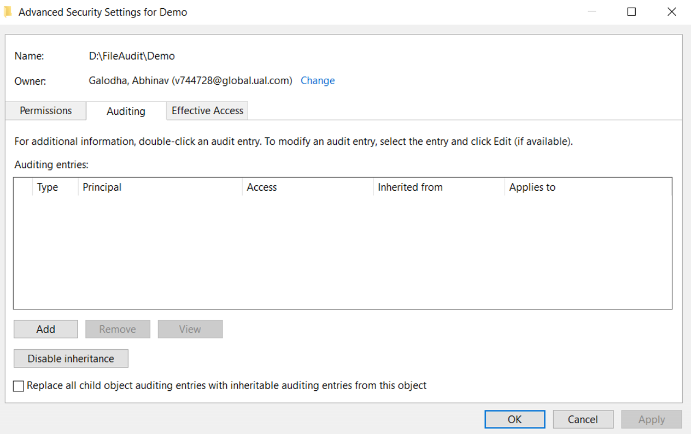
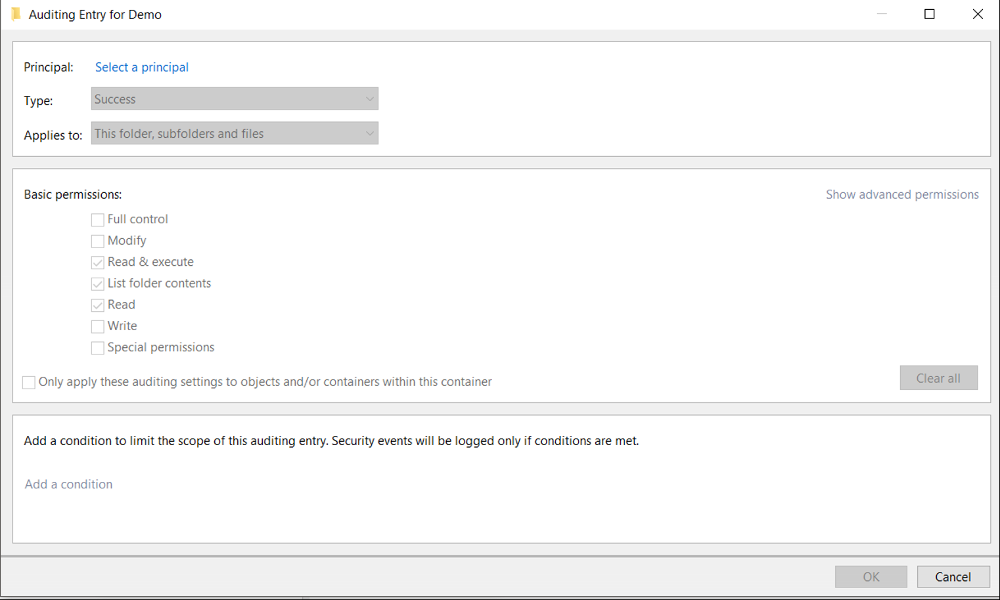
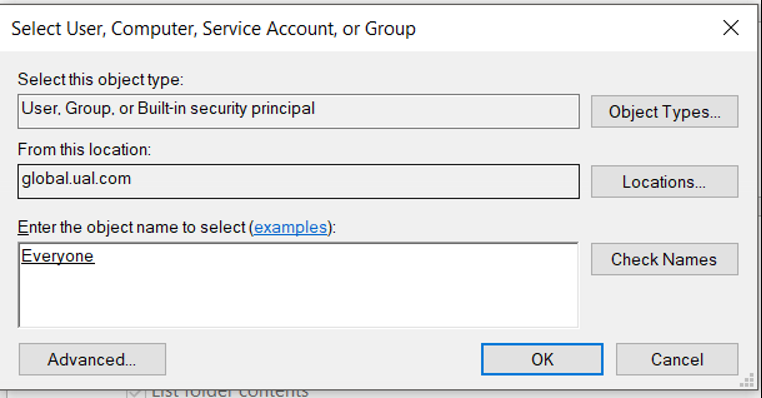
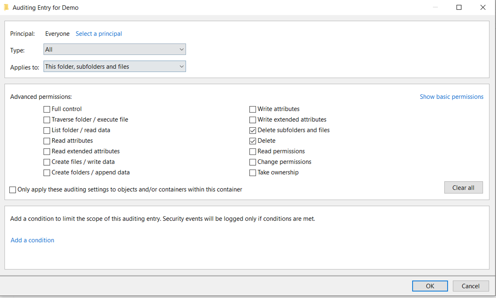
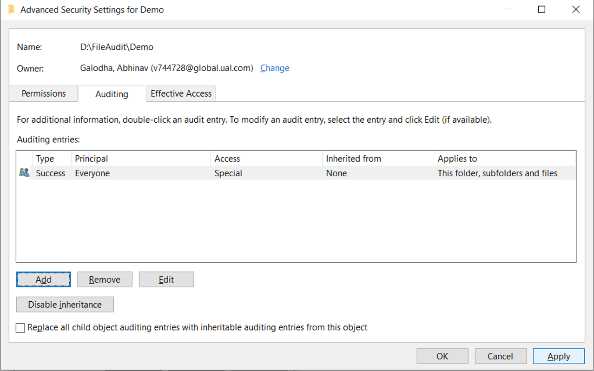

# Who deleted the file?
Have you ever a scenario, where a file has been deleted from a machine and you are wondering who deleted the file and had no idea who was the culprit. Good Luck! In this article, i will try to explain a technique available on windows machine to find out who deleted the file.

## Motivation
The reason for writing this article is that we faced this issue in our production and i thought it might be useful for readers if ever they encounter such an issue. Our problem started when one of our production server went out of the load balancer. We have an Asp.net core 2.x application, which is deployed as a Self contained Application. In a self contained deployment the complete .net core framework is bundled in a folder and it also includes your asp.net core Exe which is initiated by the IIS server. In our scenario, the exe was being deleted which was causing 502.5 process error as the Host Process couldn't be started. Since, this is a production server and has restricted access it wasn't possible that a user is deleting the file. It was random delete operation and happened on some servers while others were working fine. This was the inspiration for identifying how the exe was getting deleted.

If you couldn't follow with the this reasoning, yoy may be able to relate with following scenario where you might beed to find out who deleted the file?

* A Shared folder among the team has certain files deleted.
* The deployed application is missing certain files.

## What Windows OS offers?
Windows offers the Audit features using various Policies which allows to Audit the access requests, Audit login, Process tracking etc. The policies basically defines a registry setting which defines the behavior of the feature. 

# How to know who deleted the file?
The following process would help us in identifying who deleted the file.
1. Turn on the File Auditing Process on the System.
2. Configure the Audit process on the File/Folder to be monitored.
3. Verify the Audit Logs to get details of who deleted the file.

**Note:** You will require the Admin permissions on the machine where the File Auditing needs to be setup

Let's dig into these steps further in detail.

### 1. Turn on the File Auditing Process on the System.
Operating Systems offers the functionality to track various file operations. These features are configurable and can be turned Off/On using Policies. Windows uses the concepts of Policies to manage various settings.

Wikipedia defines the Group Policy as

> Group Policy is a feature of the Microsoft Windows NT family of operating systems that controls the working environment of user accounts and computer accounts. 

There is Group Policies and Local Policy. Local policy applies to the local computer only. Group Policy applies to all computers in a domain network. In this instance, we are going to change the Local Policy.

a. Navigate to the System which needs monitoring and open the Local Group Policy Editor by either entering `gpedit.msc` in the Run menu or typing in Group Policy in the Windows Search.

The Local Group Policy will appear as shown below.

b. Select the Object Access Section on the left tree, by navigating to Computer Configuration -> Windows Settings -> Security Settings -> Advanced Audit Policy Configuration -> System Audit Policies -Local Group Policy Object -> Object Access

c. Select the Subcategory for "Audit File System", and then right click or double click on the subcategory. Another windows pops-up, Audit File System Properties. Check the Checkboxes for the Success and Failure conditions under the Condition the following event for checkbox as shown below.

With the above mentioned steps, we have enabled the File System Auditing on the operating System. Next, we will explore how to setup logging for the Folder which needs to be monitored.

### 2. Configure the Audit process on the File/Folder to be monitored.
Basically, in this step, we will define *what* kind of File System Access (Read/Write/Delete) needs to be monitored and *what* Users & Roles need to be tracked.

a. Select the folder in the windows explorer which needs to be monitored for the file deletion.

b. Right click on folder, go to properties, Navigate to **Security** Tab and then click on Advanced button as shown below.

c. A dialog named Advanced Security Settings for <YourFolderName> would open. Go to Auditing Tab, and then click Continue. 
Note: You must me an administrator to define the Auditing policy.

d. Next, add the Audit entry by clicking the Add Button as shown below. This will open up another dialog for adding the Auditing entry.

e. Define *who* or which user should be monitored by entering the information in the prinicipal. Since, we are trying to find out who deleted the file, we will add the **Everyone**. 

> **Everyone** is the name of the special group in windows which includes Authenticated & Guest Accounts.

f. Next, Select the Type dropdown, We may select **Success** only for a file deletion operation or select **All** if we want to monitor a Success along with the failure operation. 
Also, select what permissions needs to be audited. Since, we are looking for delete operation, we need to click on the Show **"Advanced Permission"** link and then select Delete & Delete Subfolders and Files checkbox and click **Ok** button as shown below.

g. Once we complete the above step, the Audit Entry should include an entry to Audit an attempt to delete a file by Anyone on the Machine.
Click Apply and close the Dialog.

### 3. Verify the Audit Logs to get details of who deleted the file.
