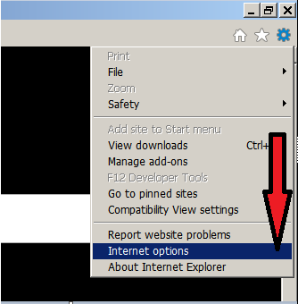
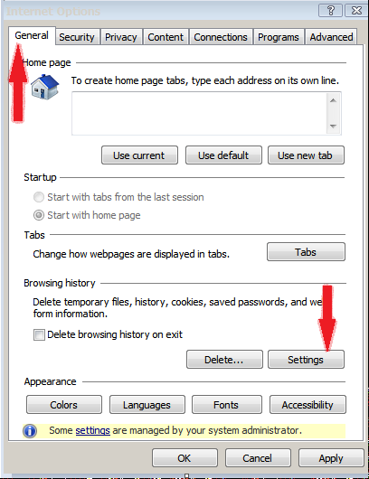
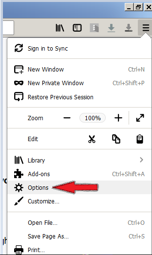
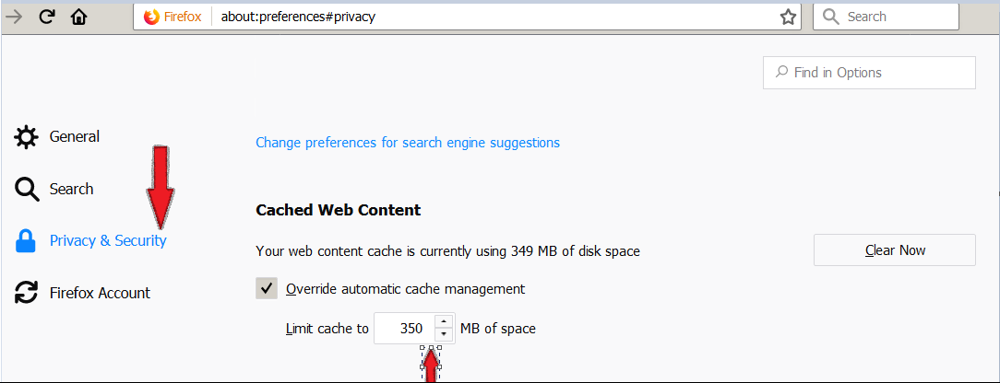

# How to Increase Http Cache Size in Browsers

## Increase Cache size in Internet Explorer (IE)

1. Launch the internet explorer.

2. Go to Tools -> Internet options.

3. Next, in General Tab, Under Browser History, Click Settings button.

4. Above step would open up a new Dialog, On Temporary Internet files tab, select the Automatically radio button under the Check for new version Of stored pages.

5. Next, set the desired value of the Disk Space to use in the textbox. The entered  value is calculated as Mb unit.

6. Click Ok and then again Ok/Apply and settings would be saved.

7. Close IE and open again ?

## Increase Cache memory in Mozilla Firefox.

1. Launch the Firefox.

2. Go to Tools -> options.

3. Select Privacy and Security options in the left side.

4. Scroll down to Cached Web Content section. You would be able to see the current cache size. For e.g. on my machine The text is Your web content cache is currently using 349 MB of disc space.

5. Check the Override automatic cache management Checkbox.

6. Enter the value in the textbox next to Limit Cache to.  The entered  value is calculated as Mb unit.

7. Restart required or not?