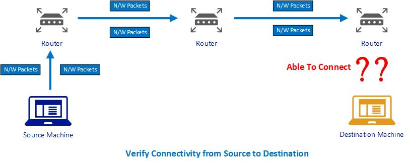
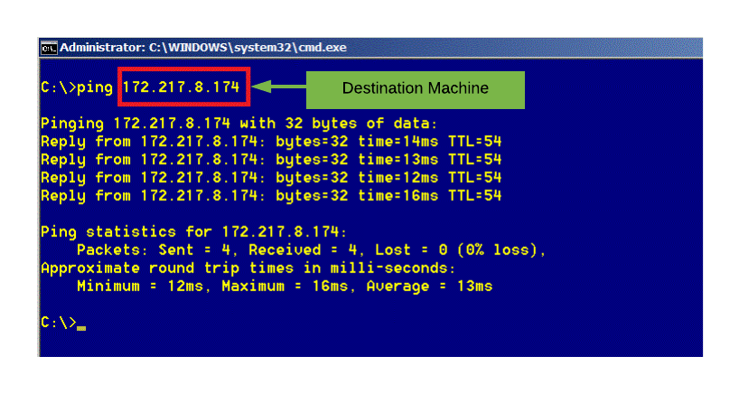
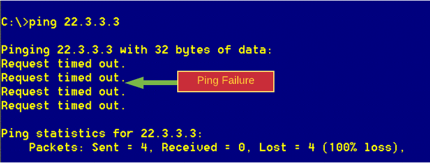
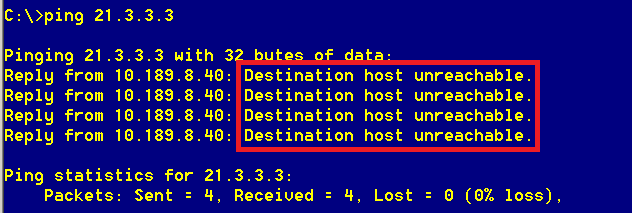
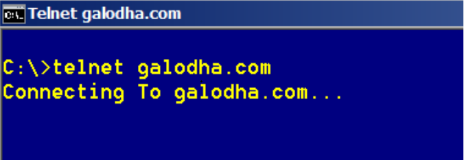
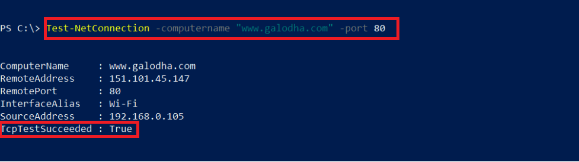
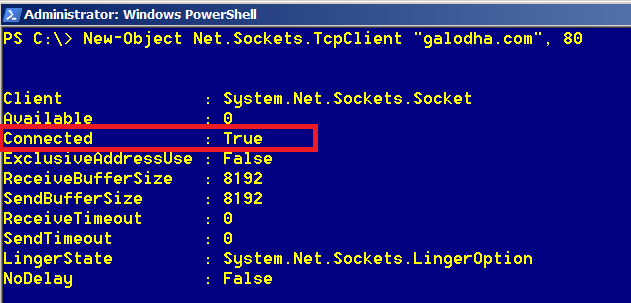
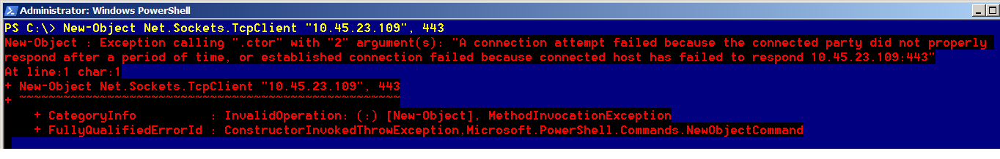

 # Various techniques to verify the Connectivity from Client to Server (including Port Number)


In an era of interconnected devices, Most of the code we write involves connectivity from one machine to another remote machine. E.g., While working on a Frontend application, it needs to communicate with Another Remote API. It's utmost essential to understand if the connectivity exists between the two machines and the port for the destination machine is open and accessible.

In this article, I will explore few techniques to test the network connectivity with another machine & Port number using the built-in tools in the operating System. No additional downloads or installation is required. Once we establish the connectivity between two machines, we can proceed ahead with our implementation details. However, if Network connectivity is not established, we may need to further troubleshoot the issue. You might find these helpful in case you need to verify the connectivity to remote machines.


***

### What are various Steps to verify Connectivity to destination machine & port?

1. The first step in this process is to verify the **Network** connectivity with the remote machine. It means that we can send packets to the remote machine or not.

2. Next, Verify the Connectivity to the Destination port to check if the port is blocked or inaccessible. This ensures that the firewall is not blocking the port.




## Check Connectivity between machines using Ping

The good old friend, "Ping." Using the **Ping** command, we can verify the network level connectivity between the client and Remote Machine.
*At the N/w level Ping rely on ICMP, which is at layer 3. Hence it doesn't check if a port is open or not.*
So, it is possible that ping works, but still, the call to the API on destination machine at the specific port doesn't work.

### How to use ping?

1. Open the command prompt.
2. Enter ping command, passing the destination machine IP or Hostname as shown below.

```
ping 34.45.5.6
```

### Successfull Response

If Ping Succeeds, we will get a reply from destination machine. This reply ensures that the connectivity exists between the source and destination machines. Following image displays the result of a successful ping response.



### Failure Response

If ping results in a **" Request timed out."**  or **"Destination Host Unreachable"** message, then there is a connectivity issue from Source to the destination. 

Some of the Possible reasons for failure are listed below

* The Source/Destination Machine is not connected to the network.
* The destination machine is not turned on.
* Other causes could include an issue with Router or a problem with other networking components.

#### Request Timed Out



#### Destination Host Unreachable



***

## Check Connectivity between machines Using Telnet

Wikipedia defines Telnet as 
>"Telnet is a protocol used on the Internet or local area networks to provide a bidirectional interactive text-oriented communication facility using a virtual terminal connection.". At N/w level, Telnet works in the Application layer and needs the ports connectivity.

Telnet gets its name from Terminal Network. With Telnet, we can establish a host session to a server. The advantage of using Telnet is that we can verify the connectivity to a port as well.

### Why Telnet is not preferred?

Telnet uses plain text for communication and hence not encrypted. Therefore, in Windows, by default the TelNet Client is disabled. Telnet can be enabled in windows by Adding/Removing windows component using Control Panel.


### How to use Telnet?

1. Enter command prompt.
2. Use telnet command passing in the Destination Server Name/Address and the port number. e.g., telnet destination 80. 

>**Note:** The default port for telnet is 23. So, if we omit the port number in telnet command, the  Telnet will try to connect to the destination using port 23.

### Telnet succeeds

After entering the telnet command, we will see the text `Connecting to HostName...` as shown in below image.



If the connection succeeds, We will see a blank screen. Notice the Title of the console window. It should read `Telnet <DestinationName>`


### Telnet Failure


If the destination Machine or the port is inaccessible, we will get the error *"Could not open connection to the host, on port 80: Connection failed"*


### What if Ping works successfully and Telnet fails?
It might be the case that the port is blocked. Firewall can block the traffic. This firewall can either be on your local machine or the server. Check both ends for a firewall. If the actual server is on a different network, for example across the Internet, there could be other firewalls in the middle too.

***

## Check Connectivity between machines using Powershell
My preferred option, Powershell, It is powerful as It allows to explore all the potential of a .net framework as we can call .net framework methods using powershell.

### Option 1 - Test-NetConnectioncommand

If you're running Windows 8/Windows Server 2012 or newer, you can use the Test-NetConnectioncommand.

The Test-NetConnection cmdlet displays diagnostic information for a connection. It supports ping test, TCP test, route tracing, and route selection diagnostics. For our purpose, we are going to use the cmdlet with destination name and the port number.


### How to use Powershell Test-NetConnection

Provide the HostName/IP and the port number to verify the connectivity.

```
Test-NetConnection -Port 81 -ComputerName "www.galodha.com"
```

#### Success

If we get the message `TcpTestSucceeded : True`, then it means that the connection to the destination machine and port is successful.



#### Failure 

A value of `PingSucceeded : False` or the `Timedout` error message implies that there is an issue with N/W connectivity.


### Option 2 - System.Net.Sockets.TcpClient

Another option using PowerShell is making use of the .Net Class `TcpClient`. This class has a constructor which takes in the Destination Server Name and the Port number.This constructor creates a new TcpClient and makes a *synchronous* connection attempt to the provided host name and port number. `TcpClient` will block until it either connects or fails. This constructor allows you to initialize, resolve the DNS hostname, and connect in one convenient step.

### How to use Powershell TcpClient

Create a new Object using the TcpClient class as shown below passing in the HostName/IP and the Port Number.

```
New-Object Net.Sockets.TcpClient "10.45.23.109", 443 
```

#### Success

If the `Connected` Property is `True`, then connectivity succeeds.



#### Failure

If the `Connected` Property is `False` or you get an error message, then it indicates a network Connectivity issue.




***

## Summary
In this article, we explored three techniques to verify the connectivity to the destination machine and the port number. We looked at the Ping, Telnet and PowerShell commands to verify the connectivity. These techniques are mostly supported on Windows Operating System.

  