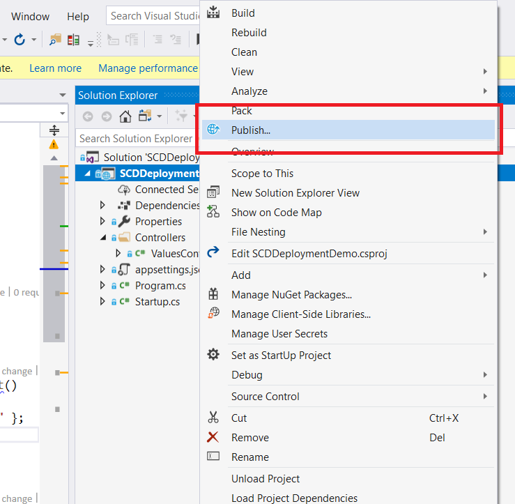

# Step by Step guide for Deployment of Asp.net Core applications  in IIS

## Introduction

In this article, we will do a step by step setup of an Asp.Net core Application in IIS. The Web Site/Web API will reside in IIS and can leverage the existing functionality of the IIS.We will take a look into various options of Deploying an Asp.net core application like Self Contained Deployment and Framework Dependent Deployments. I would be using Visual Studio 2019 Preview and Asp.net core 2.2 SDK. If your VS or .net SDK version is different, there might be subtle difference in the steps but majority of steps should remain the same.

## Why Host in IIS

IIS is the one of the stable Application Server in the Market today. It offers a lot of functionality like Process management.

<TODO> : Add a couple of features of IIS.

Asp.net Core uses a new Kestrel Web Server for Managing the Asp.net core Requests. 

## Publish the Asp.Net Core Application

The first step is to create Artifacts/outputs for our Application. We need to compile our application and prepare the outputs so that it can be served by an Application Server. We will use the publish option for artifact creation. Asp.net core can be published in 2 ways, Self Contained Deployment and Framework Dependent Deployment.

### Deployment Modes - Self Contained Deployment / Framework Dependent Deployment

* Self Contained Deployment (SCD)
  * Ships the entire Asp.net core runtime and the application together in Same Folder.
  * Allows side by side versioning allowing multiple versions of the Asp.net core runtime to be used on the same machine.
  * Need to specify the Target machine runtime.
  * Artifact size is bigger.
  
* Framework Dependent Deployment (FDD)
  * Requires the Asp.net core runtime to be installed on the machine.
  * Artifacts size is smaller.
  * Doesn't allow multiple version of the .net core runtime to be installed.
  * Same Deployed package can be run on multiple machine as there is no limitation to specify the target machine runtime identifier.

You will need to decide which deployment mode works for you. For more information, refer here
<ToDO> Ms docs link. 

### Code and Project Setup

To keep this article simple, we will create an Asp.net core API Project and deploy it to the IIS. I will not make any changes to the code as created by the default template as our focus is on the deployment.

##### Create new Project in Visual Studio

This is how our file structure looks in Visual studio. It has one controller, ValuesController. We will use the Http GET method on the values controller to validate the deployment.

 

Let's take a look at the various deployment options as mentioned above.

### Self Contained Deployment (SCD)

We will deploy our application as SCD, so we need to publish our application in the Self Contained deployment mode which would bundle the application and the Asp.net core Runtime. We can either publish using the Visual Studio or Dotnet CLI. Next, let's take a look at each option.

#### Publish using Visual Studio

Right click on the API/Web Project and you will see an option of Publish as shown below. 

Clicking on the publish option open a new dialog as shown below. This dialog provides various options to deploy. Again, to keep the article simple, 

#### Publish using command line/ Dotnet cli

### Pros and Cons

## Installation on the IIS Server

### Hosting Bundle

#### VC Runtime

### Application Pool

### Website setup and Mapping

#### In Process and Out Of Process Hosting

### Validation Steps

## Conclusion

### References

#### Version History

3/4/2018 - 1