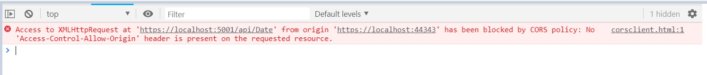
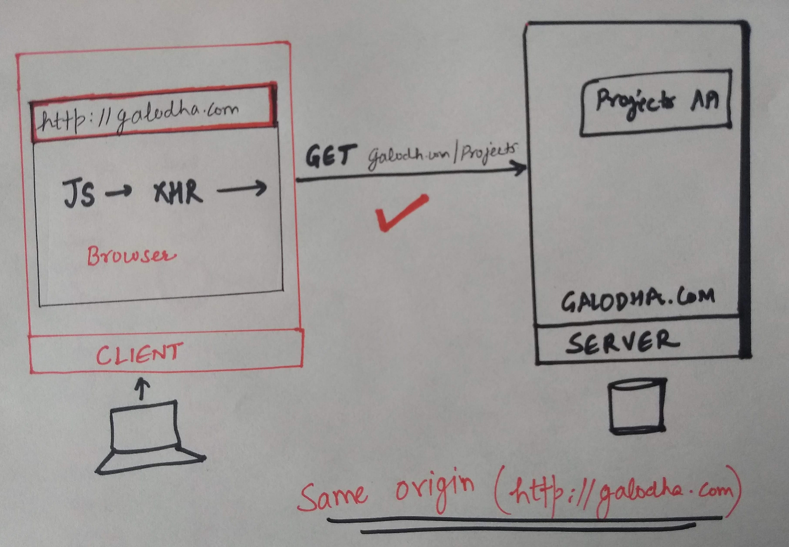
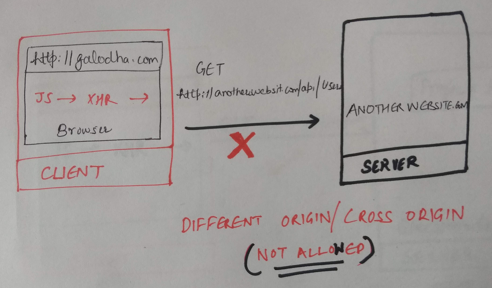
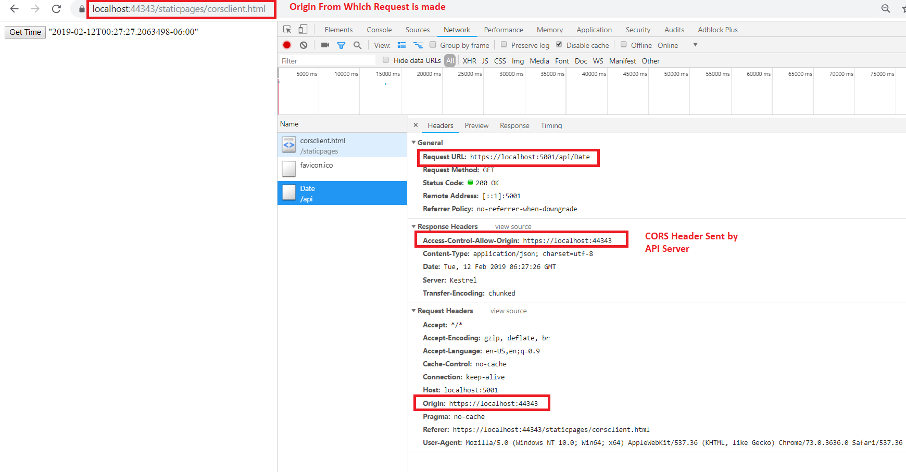
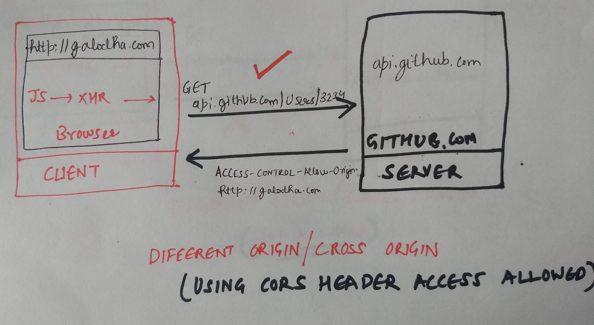
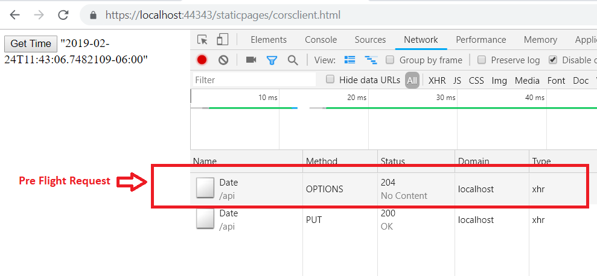

# All you wanted to know about CORS

- [All you wanted to know about CORS](#all-you-wanted-to-know-about-cors)
  - [What's CORS and Adding CORS support in ASP.Net Core](#whats-cors-and-adding-cors-support-in-aspnet-core)
  - [Introduction](#introduction)
  - [Importance of CORS & How Microservices are shaping the modern Application development?](#importance-of-cors--how-microservices-are-shaping-the-modern-application-development)
  - [What is CORS?](#what-is-cors)
    - [Analogy of an Apartment Community](#analogy-of-an-apartment-community)
    - [What is an Origin?](#what-is-an-origin)
      - [Example of Same Origin](#example-of-same-origin)
      - [Example of Different Origin](#example-of-different-origin)
    - [What is meant by Same Origin Policy?](#what-is-meant-by-same-origin-policy)
      - [Example: Same Origin Allowing communication](#example-same-origin-allowing-communication)
      - [Example: Cross Origin (Different Origin) Forbidding communication.](#example-cross-origin-different-origin-forbidding-communication)
      - [Why browsers enforced Same-Origin Policy?](#why-browsers-enforced-same-origin-policy)
        - [Example](#example)
      - [Cross-Origin](#cross-origin)
      - [Resource](#resource)
      - [Sharing](#sharing)
  - [How CORS allows to bypass the Same-Origin Policy?](#how-cors-allows-to-bypass-the-same-origin-policy)
      - [Access-Control-Allow-Origin](#access-control-allow-origin)
      - [Example](#example-1)
  - [Pre-flight requests](#pre-flight-requests)
      - [Why does browser sends an additional request in form of pre-flight request? Isn't it an overhead?](#why-does-browser-sends-an-additional-request-in-form-of-pre-flight-request-isnt-it-an-overhead)
      - [Example : Why Pre-flight request was added?](#example--why-pre-flight-request-was-added)
      - [What conditions Trigger a PreFlight Request?](#what-conditions-trigger-a-preflight-request)
  - [References](#references)

## What's CORS and Adding CORS support in ASP.Net Core

This article is a first part in a series of two articles for CORS. This part provides an introduction to CORS which will help you grasp the CORS Concept in an effortless way and allow you to better design, understand, and troubleshoot CORS issue.

In the next part, we will go into further details and apply  the knowledge learnt in first part to build a Client & Server application which can communicate using CORS. The link would be added for the second part once available.

## Introduction

* Do you want to understand CORS?
* Does it sound too complicated to understand and the explanation you find is mostly confusing and hard to follow?
* Are you building Microservices and worried about integrating with multiple frontend application?
* Have you encountered the following error, and never understood why the error happens?

 This article is will provide a **simplistic** explanation of CORS using real world analogy. We will go into the details of what you need to understand & troubleshoot CORS Issue. The article will also describe *how to add* the CORS support in an Asp.net core web API to enable multiple clients in different domains to interact with the API. Later, we will demonstrate an interaction between a static webpage accessing an API on a different origin.

## Importance of CORS & How Microservices are shaping the modern Application development?

In modern software development, with the advent of the microservices and the rise of the Distributed applications, more components than ever before are being developed in isolation. The monolith applications are being architectured to build smaller more manageable components in the form of the Asp.net core web API. The microservices can be deployed and scaled independently of the frontend. Also, since the Frontend needs to communicate with the API, it is the API responsibility to ensure that it allows the clients to interact and send appropriate data to clients to enable secure communication. CORS forms a major specification which allows an API to accept multiple incoming requests from different websites.

## What is CORS?

CORS abbreviation is CROSS ORIGIN RESOURCE SHARING.

Credit: Getty Images

**Cors is a SECURITY mechanism employed by the browsers like (Firefox, Chrome, IE etc.) to prevent the browsers from making calls to another Website.**
A request for a resource (like an image or a font) outside of the origin is known as a cross-origin request. CORS (cross-origin resource sharing) is a specification which manages cross-origin requests.

>*A more naive explanation - It's like the Security Guard which prevents a malicious person from entering your premises until they possess certain Authorization and hence keeps your family Safe.*

### Analogy of an Apartment Community

Let's take an analogy to understand CORS. Imagine, You are living in a **secure** Housing Apartment Community and have access to all the facilities and having a great time 😄. The access to the community is restricted to its tenants only to ensure safety.  If you are a tenant, then you can come in/out at any time. For anyone else, the permission is denied.

You are thinking about your **Birthday party** in your community swimming pool and want to invite your friends. Since the access to the pool is only restricted to tenants, how would you sneak in your friends? 

In order for them to enter the apartment community, **you need to establish a mechanism to allow your friends to come inside the Apartment Complex**. One of the mechanism might be giving your friends some Unique Passes which the security would trust and allow access.

Above analogy was a simplistic explanation to understand the overall concept of the CORS. The notion of the security for a Housing apartment is similar to the security implemented by the browsers using the **same origin policy**. I will refer to this example later while explaining the CORS concept in this article.

Let's understand what is all this fuss about Origin and what exactly is Origin in next section. This is the most important Concept to decipher CORS easily.

### What is an Origin?

Let's take a look at what exactly is Origin. An Origin is made up of the following three parts:

1. **Protocol/Scheme** : (Http/https)  
2. **Host** : The server/domain name  
3. **Port number** : The numeric value

Therefore a url like http://galodha.com, represents a Origin.

#### Example of Same Origin

Let's consider following two Url's which belongs to same origin, http://galodha.com.

<http://galodha.com/image1.jpg>  
<http://galodha.com/image2.jpg>

Above Url's are having the **same Protocol** (https), **Host** (galodha.com), and **Port Number** (80 by default for HTTP communication).

#### Example of Different Origin

Following are example of Origins which are having different Origin than http://galodha.com. One of the Url's is having a different protocol and other belongs to a different Host.

<https://galodha.com/image1.jpg>  (Different protocol)  
<http://github.com/image1.jpg>  (Different host)

Now, after gaining the understanding of Origin, let look at what exactly is the Same-Origin Policy.

### What is meant by Same Origin Policy?

The same-origin policy is a security measure standardized among browsers. It prevents different origins from interacting with each other, to prevent attacks such as Cross Site Request Forgery. Referring to our analogy, Same origin is like the tenants belonging to the same apartment community. You can trust a tenant in your Apartment Community, but wouldn't trust another person in other Apartment Community, unless they are your friends.

#### Example: Same Origin Allowing communication

Following image shows the communication between client and browser in same origin. A Client browsing website `http://galodha.com` can  make the calls to `http://galodha.com/projects` API to get the data. The origin **(http://galodha.com)** is same for the client and the server and hence communication is allowed. 

**The same-origin policy is very restrictive.** This prevents JavaScript from making requests across different Origin. Although the same-origin policy is effective in preventing resources from different origins, it also prevents legitimate interactions between a server and clients of a known and trusted origin.

#### Example: Cross Origin (Different Origin) Forbidding communication.

Following image shows the communication between 2 different origin. Client browser is browsing website at origin, `http://galodha.com` and making ajax requests to `http://anotherwebsite.com/api/users` which is at origin `http://anotherwebsite.com. Since the client and server are at different Origin, the communication is forbidden.

#### Why browsers enforced Same-Origin Policy?

The same Origin policy was enforced in order to prevent security attacks like CSRF (Cross Request Forgery).

##### Example

If you are browsing a bank website and in another tab while watching your favorite video, you have an advertisement, **"You Won the  lottery"**, you are enticed by the ad and click the advertisement, it opens another window. The Advertisement is a malicious website and has ajax code to send the money from your account to Malicious site owners account. 

`$.post('http://yourfavouriteBANK.com/transfer', { to: 'maliciousOwner', ammount: '10000000' })`,

 Without further security measures, this would work because authentication cookies from `yourfavouriteBANK.com` would be sent and authenticate you. All the communication from one Origin to another is possible without restriction and can lead to above attacks.

For more information, you may read [here](https://www.owasp.org/index.php/Cross-Site_Request_Forgery_(CSRF))

CORS allows to circumvent the Same origin policy while not compromising on the security.

Let's break the CORS into smaller pieces to understand it better.

#### Cross-Origin

Cross origin means that the **origin** of the request can be *different* from the domain that made the request. In Simple words, when a user browsing website X makes another request to website B, it is considered as Cross-Origin.

In our analogy, Origin refers to Apartment Community. 2 tenants from the same Apartment Community belong to same Origin. However, your friends residing in another Apartment community are in different Origin or Cross Origin.

#### Resource

A resource is like an Image, font, Videos, Data etc. When we are making an Ajax call, we are requesting for some data which is Resource as per the terminology.

In our analogy, swimming pool was the resource. This is the valued possession which other people are interested to access.

#### Sharing

CORS defines various headers which allows the browser and server to communicate about which requests are (and are not) allowed and enable the resources to be shared.

In our analogy, swimming pool was to be shared.

In our Analogy, we had a Secured Apartment Community which only allowed the tenants the access to the resources. Imagine if the access to the apartment resources is not restricted, a malicious person can enter the Community and damage the swimming pool or other resources.

## How CORS allows to bypass the Same-Origin Policy?

CORS specification provides a list of **Headers** values which **browser** and **server** communicate and understand to ensure that the different Origin can share resources. 

*In our Analogy, this was the **Unique pass** which allows your friends to inform the Security that you have permission to enter into the Apartment community.*

Client sends Requests to server and server responds by providing the information of the resources that are allowed and how the resources can be accessed. The Server sends the information in the Response Headers. Each Response header signifies an attribute for the resource sharing. For e.g. The header `Access-Control-Allow-Methods` specifies the list of HTTP methods (GET, POST, DELETE etc.) which are allowed by the Server.

Following image shows how CORS response headers allows communication between 2 different Origin.

* Server: `https://localhost:5001`
* Client: `https://localhost:44343`

Due to same origin policy, the Ajax request is blocked to a different Origin. However, We have enabled the CORS on the API at `https://localhost:5001` by adding the response headers `Access-Control-Allow-Origin: https://localhost:44343`, which is allowing the API at `https://localhost:5001` to receive any request from Origin `https://localhost:44343`

Most of the headers are prefixed with 'Access-Control-Allow'. Few Examples are  shown below.

* `Access-Control-Allow-Origin`
* `Access-Control-Allow-Headers`
* `Access-Control-Allow-Methods`
* `Access-Control-Allow-Credentials`

The most important of these is `Access-Control-Allow-Origin`, Let's explore this header.

#### Access-Control-Allow-Origin

The `Access-Control-Allow-Origin` header allows servers to specify a list of Origins with which the server will share the resources. 

*Referring back to our analogy,This basically allows to specify the list of friends which are allowed in your pool party. You are allowed to specify the list of the names that you would want to allow for the party. If you friend name is not in the list, they will not be allowed to come inside.* 

During development stage, the value can be set to `*`, meaning that Server will share the requested resources with any domain on the Internet. But please refrain from using this setting beyond local development.

#### Example

A browser client from Origin, `http://galodha.com`, wants to send a request to server `https://api.github.com` 
Due to Same origin policy, the Client can't send the request to server.  However, when the Server responds with a response header `Access-Control-Allow-Origin: http://galodha.com` to the client, The Client Browsers allows to make a request to Origin `http://api.github.       

## Pre-flight requests

At Certain times, an additional Server Request is made by the browser  **before** the actual request, which is also known as the Pre-Flight Request. Preflight requests use the OPTIONS header.

#### Why does browser sends an additional request in form of pre-flight request? Isn't it an overhead?

The first time, I read about the Pre-flight request, I couldn't make much sense of the concept, why do we need an additional Request to send before the actual Request. Isn't it a overhead of making an additional request? 

The Pre-flight Request was added to the CORS Specification to allow communication with the *Old* Servers which don't understand CORS and safeguard against the Potentially dangerous requests like Delete.

Following screenshot from the Chrome Developer tools shows the OPTIONS Request before the actual request is made. This is the pre-flight request.

#### Example : Why Pre-flight request was added?

Let's go back in past, and Assume a time when CORS Specification wasn't defined. **Servers were not aware of the CORS Specification**, but did understand the Same-Origin Specification and allowed requests from the Same Origin Only.

A Origin like `http://galodha.com` is used by a server X for hosting blogs at `http://galodha.com/blogs`. This Server X knows about the same Origin policy and allows operation like **Delete** a blog post from the same origin.

Now, CORS specification is launched. A new server Y is setup to manage projects at URL `http://galodha.com/projects`. The server Y supports the Get/Post/Delete operations on projects on same origin.

The Projects are getting popular and other websites are interested to list the projects on their websites. So, you will need to allow for a Get Operation from the origin `http://galodha.com`. Also, there are open source contributors, so you need to offer the Delete operation as well from other websites/origin. Fortunately, the CORS specification has been launched and you know that by using the CORS header `Access-Control-Allow-Origin: http://anotherwebsite.com`, we can allow the requests from another website/origin. Also, using the CORS header, `Access-Control-Allow-Methods: Get, POST, Delete`, we can allow the `GET/POST/DELETE` operations from other websites.

So far so good, everything is going good and Your Server Y is getting a lot of traffic from other websites.

Next, A malicious user enters, and is using `http://anotherwebsite.com` and tries to perform a **DELETE** operation on the URL `http://galodha.com/blogs` on Server X. The origin `http://galodha.com` already allows requests from other websites for Server Y at `http://galodha.com/Projects`. Note that the Same origin policy consider *only* the Scheme, HostName and port number, It doesn't consider the full path of the URL. So, a client can make a request to both `http://galodha.com/blogs` and `http://galodha.com/projects` as the browser thinks that both belongs to same origin.

Since, Server X allowed Delete operations from same Origin and It doesn't know anything about the new CORS specification, what should be the behavior for a DELETE operation on server X requested from another website/origin?

**Should it allow to delete a resource?.** Wouldn't it be wonderful if server X can tell that it doesn't support CORS? Can't we make an additional Request to check if a Server support CORS? 

Yes, You are in Good luck, The CORS specification, defines the Preflight Request which does the same things as we mentioned above. The PreFlight Request makes an additional request to ensure that the Server understands the request or not. If server doesn't understand the request, then the client will not make the actual Request. However, if server understands the request, it will return the appropriate response mentioning that what it allows and then client can make the actual request.

#### What conditions Trigger a PreFlight Request?
A Pre-flight request is not made for all the Requests, but is only applicable in certain cases. Following is the list of the conditions which govern if a pre-flight request is made or not.

* When the actual request is any HTTP Method other than `GET, POST, or HEAD`.
* If a POST request's content type is anything other than `application/x-www-form-urlencoded`, `multipart/form-data`, or `text/plain`.
*  Also, if the request contains any custom headers, then a preflight request is required. Headers like `Accept`, `Accept-Language`, `Content-Language` etc doesn't trigger a Preflight request.

There are certain additional conditions which can trigger the Preflight request. For the complete list reference the [link]( https://developer.mozilla.org/en-US/docs/Web/HTTP/CORS#Simple_requests).

## References
* https://developer.mozilla.org/en-US/docs/Web/HTTP/CORS  
* https://stackoverflow.com/questions/15381105/ 
* cors-what-is-the-motivation-behind-introducing-preflight-requests

