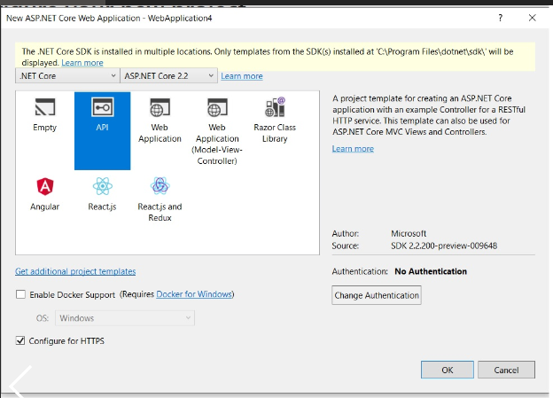
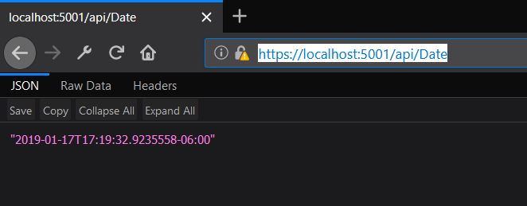
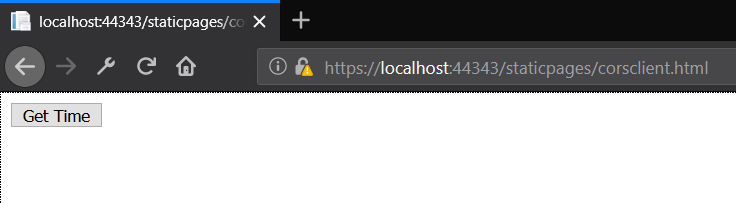
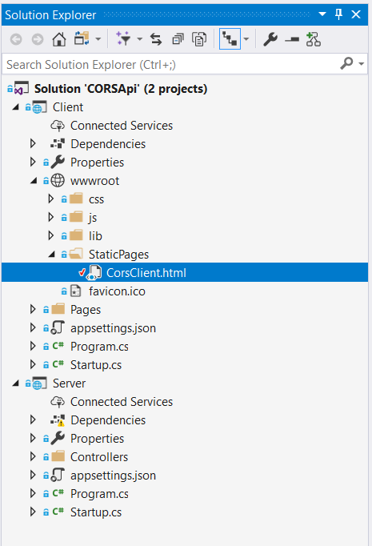
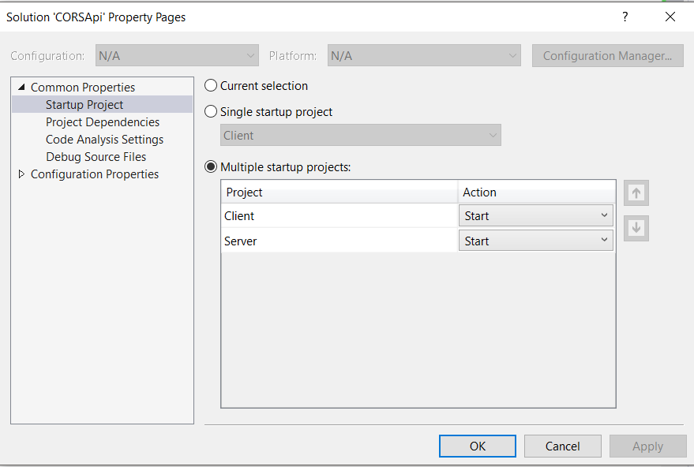

# All you wanted to know about CORS - 2

###

## How CORS work?


## Demo Application

To demonstrate CORS policy in action, we need a Client (Web Page) and a Server (API). Both should be running on seperate Origin.

We will create a Server side API (.Net Core) and a frontend client which will invoke the API.
The API is just returning the Current Server Date time and then UI refreshes the span with the latest date time.

### Server Side API - (Asp.net core)

1. Add a new Asp.net core project selecting the API Template as shown below.

    

2. Next, add a DateTime Controller, which will have a Get operation which would return the current date time of the server.

    The code for the `DateController` is shown below.

    ```
    [Route("api/[controller]")]
    [ApiController]
    public class DateController : ControllerBase
    {
        // GET api/values
        [HttpGet]
        public ActionResult<DateTime> Get()
        {
            return DateTime.Now;
        }

    }
    ```

3. Let's test the Date controller's, Get Method, we will open the browser and browse to API Host address, which in mine machine is `https://localhost:5001/api/Date` and we can see the Current Server date time. Works perfectly. Neat..

    

    Please note that the Server Address will depend on your configuration. Next, let's build a Client Application.


### Client - (HTML Page with JS)

To keep the demonstration simple, I will use a simple web page with javascript to call the API.



1. The web page has 2 controls a `Button` control to click and a `span` to show the output. On Click of a button we will invoke our API to get the Current Server date time and update the span value.

    Following shows hows our HTML page might look like.
    ```
    <!DOCTYPE html>
    <html>
    <head>
        <title>Sample CORS Client</title>
    </head>
    <body>
        <button type="button" onclick="getCurrentServerDateTime()">Get Time</button>
        <span id="currentServerDateTime"></span>
    </body>
    ```

2. Let's wire up the javascript to call the API and see what response do we get. To keep it simple and avoid any dependencies, i am using the native `XMLHttpRequest` object to connect to the API.

    We will get the API Url, which in our case is running at `https://localhost:5001`, then construct an `XMLHttpRequest`, set the properties and call the send method.


    ```
    <script type="text/javascript">

        function getCurrentServerDateTime() {

            var apiUrl = "https://localhost:5001/api/Date";
            var xhr = new XMLHttpRequest();
            xhr.addEventListener("load", responseCompleted);
            xhr.open("GET", apiUrl);
            xhr.send();
        }

        function responseCompleted(eventData) {

        }

    </script>
    ```

3. So far so good, we need to host the website in a different origin. We would be creating another Asp.net core MVC project for hosting client side code. We would be adding the web page created above to the `wwwroot` folder which is the place for all the static content in asp.net Core and allows to serve the content from the client side.

    Let's peek a look into the solution explorer in visual studio to see how it looks.

    

4. Let's keep Rolling and test the web page interaction with the API. 
   
 Go to visual studio, and change the solution properties to allow for multiple start up projects. This allows to launch both the client and Server projects with one click as shown below.

 

Before adding the CORS middleware into the Asp.net core pipeline, let's see how the response looks like if we try to call the API from a web page running on another domain. Let's create a simple Web page which we will host in an asp.net core website. 


1. Asp.net supports the CORS Middleware which we can plugin into our request pipeline to add CORS support to our API. Let's see how to add CORS to our Asp.net core API. Add the Reference to package  `Microsoft.AspNetCore.Cors package` which provides the sup


We need to 
Inner Workings

Let’s have a look at the picture below. There is a client app (https://example.com) sending a GET request to a server app (https://example.net) for some resource:

Enabling CORS in ASP.NET Core

All modern browsers set the Origin header automatically, which indicates the domain of the site is making the request.

If the server allows Cross-origin requests from the Origin (https://example.com), it sets the Access-Control-Allow-Origin header with its value matching the origin header’s value from the request.

In other way, if the server doesn’t include this header, the request fails. The browser shall receive the response data, but this data shall not be accessible to the client.

## How to add CORS in Asp.net core

There are 3 steps to enable CORS in a server app:

First of all, we need the Microsoft.AspNetCore.Cors package in our project. It should be already installed in our project via the Microsoft.AspNetCore.App package, which is created as soon as our project was created. But if for some reason, you can’t see that package in the Solution Explorer, go to Tools -> NuGet Package Manager -> Manage NuGet Packages for Solution. Search for Microsoft.AspNetCore.Cors and install the package.

Next, we need to inject CORS into the Asp.net pipelines so that it can be used by the application. In Startup.cs class, let’s go to the ConfigureServices method and register CORS:

Registering CORS
    
    	
```
public void ConfigureServices(IServiceCollection services)
{
     services.AddCors();
     services.AddMvc();
}
```
    
To enable CORS for our application, let’s add the CORS middleware to the HTTP request pipeline in the Configure method, just below the if-else statement. Let’s specify an URL from where the CORS requests are allowed when building the CORS policy. Here, we have given the Client URL:
Allowing requests from the client
    	
``` 
    app.UseCors(builder =>
        builder.WithOrigins("http://localhost:55294"));
```

Let’s save our Server app and re-publish it to the App Service. Now let’s open the client app and click the Try button. We should see an HTML document retrieved from the server app:


## Sample Application

## Testing CORS is working and validating

## Configuring CORS Server

```
{
    services.AddCors(options =>
    {
        options.AddPolicy("AllowOrigin",
            builder => builder.WithOrigins("http://localhost:55294"));
    });
 
    services.AddMvc();
}
```

## Configuring CORS Client

If we only want to allow CORS requests to a selected few methods, instead of enabling CORS at the entire application level, we can also enable CORS at the controller level or at the action level.

### Configure CORS Policy Options

## How it actually works?
`

## Summary


## References
https://developer.mozilla.org/en-US/docs/Web/HTTP/CORS
https://stackoverflow.com/questions/15381105/cors-what-is-the-motivation-behind-introducing-preflight-requests

