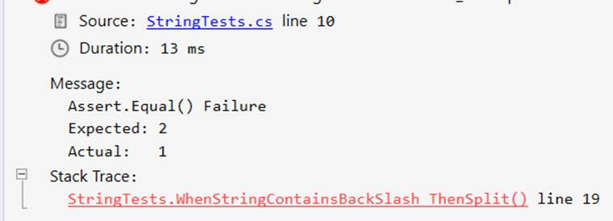
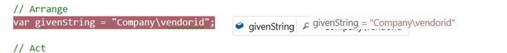
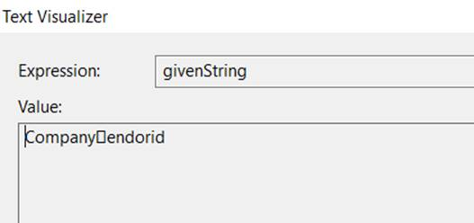
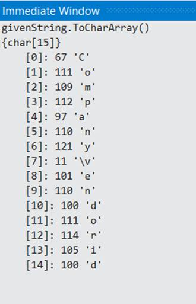
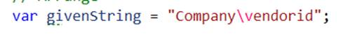

# Don&#39;t believe what you see

### Version History

| S.No. | Date | Changes | Effort |
| --- | --- | --- | --- |
| 1 | 1/30/2020 | First Draft Added - Outline added | 30 mins |
| 2 | 1/31/2020 | Added Steps to troubleshooting | 60 mins |
| 3 | 2/1/2020 | Modified Purpose | 30 mins |
| 4 | 2/4/2020 | Added Fixes and Philosophical Reflections | 60 mins |
| 5 | 2/6/2020 | Conclusion, Grammarly check, ProofReading | 150 mins |
| 6 | 2/7/2020 | Added Code project | 30 mins |
| 7 | 2/8/2020 | Added Markdown, Proofread | 60 mins |
| 8 | 2/8/2020 | Added Gif | 30 mins |

## Tags

| #Unicode | #Editor | #Tools | #Debugging | #Visual studio | #ReSharper | 

## Purpose

In this article, we will cover a problem that doesn&#39;t seem noticeable and is hard to trace.
However, if you understand the root cause, you will save yourself a lot of trouble and will help you with similar issues.

In the following article, I will describe the step-by-step instruction on how I troubleshoot the error, the root cause, and the tools helpful for debugging these issues.


## Details

The problem is a simple string manipulation example. We have an input string and we split it, and then verify if the string is split correctly or not.

You might be just thinking that is the easiest thing to do and maybe the second program you wrote after writing the hello world. Let&#39;s go through the details and uncover the mystery.

Please take a look at the following code and suggest if the test will pass or fail?

```
[Fact]
public void WhenStringContainsBackSlash_ThenSplit()
{
    // Arrange
    var givenString = "Company\vendorid";;

    // Act
    var splittedArray = givenString.Split("\");

    // Assert
    Assert.Equal(2, splittedArray.Length);
}
```

Seems easy.

**If you expected the test to pass, then you have made the same mistake that I did. The above test fails.**  If you were correct to guess then you probably have a good understanding of the problem and well done, pat your back.

The above code was shared from another co-worker and the first time I saw, I thought this should be an easy fix. After all, the string manipulation shouldn&#39;t be difficult. 
I have been working in C# for more than a decade, and at first sight, the code above looked obvious to me and should have worked.

When I saw the failing tests, I was in a surprise. Let&#39;s look at the steps I followed to troubleshoot the problem. If you want to Follow along, please feel free to use the source code at the Github repository

## Steps to troubleshoot

1\. A well-Designed system provides clear instructions for unexpected behavior. I am using Xunit and it provides a descriptive error message which eases further troubleshooting. In the Failed test description, the actual value is 1. However, the expected value was 2. It means no exception was thrown, and the Split didn&#39;t work as expected.



2\. Trusting my instincts I quickly scan the code and see if any mistakes in the code. The split symbol looks fine. But the test failed.

3\. No clue, Let&#39;s use  Visual studio to rescue and debug the code. Visual studio provides a smooth debugging experience and helps find out what is happening. 

First, we will look at the variable `givenString`, the debugger shows the value correctly as shown in below image.



Then I need to check the splittedArray. The split operation is not throwing an exception, but the Split operation returns the original string. Wait, what happened, The Split function is Not working as expected.  This helps us to narrow down the problem, it seems the problem with the `Split` function. Bare eyes, the code looks fine and the split should have worked.

I will check the string value in the String Visualizer in the Visual Studio.The `\v` is not appearing in a string visualizer and a box-like character is displayed instead as shown in below image. This gives us a hint that the `\v` is not treated as literal characters `\` &amp; `v` but it is something different.



4\. Focus the attention on the Strings.

What is the String `Split` operation doing?

C# strings are stored as UTF-16 and represented as Char array. The split function would scan the string until it finds the Split character in the string and then starts splitting.

To further diagnose the Split problem, it is better to check the Character representation of the string. I will switch over to Immediate window in Visual Studio and check what actually is the character representation of the String. I will use the `ToCharArray` method of the `String` class. Visual Studio debugger is extremely helpful and provides the character values along with their Unicode values.
The following screenshot provides the output of the `ToCharArray` function.

 

Interesting to note that the 7th index of the array is the char `\v` with a Unicode value of 11. We were expecting 7th char to be backslash, `\` and 8th char to be `v`. 

Looking at the backslash, the escape bells start ringing in my head. Just kicking myself, why I didn&#39;t look at the escape character.

5\. From the above step, we can logically conclude what&#39;s going on. The Split function is not able to find the `\` in the string and hence the string split function is not working.

Wohoo... We found the issue.

6\. Let&#39;s check why is the `\v` is not represented as 2 characters which we were expecting and is recognized as a single character. Some searching and a few minutes later, I can see that `\v` is used to represent the vertical tab and was mostly used for the printers.

I can find the documentation [source](https://devblogs.microsoft.com/csharpfaq/what-character-escape-sequences-are-available/) for C# mentioning the escape sequence.

I had been working with C# for more than a decade, but I must confess, I didn&#39;t have the slightest idea about the `\v`. I definitely would have read this in my younger years when I was learning C#, but after so many years, I didn&#39;t have any idea.

Finding the root cause of a problem is the most satisfying experience. The investigation might take time, however the solution/fix is generally less time consuming. Let&#39;s look at the fix for the problem.

## Fix

The `\v` is an **escape sequence** and is a special symbol that needs to be escaped.I will explain 2 possible fixes for the problem

### 1. Verbatim String

I will add the **`@`** symbol at the beginning of the string.

This would make a **verbatim** string. *A verbatim string provides a way to write a string representation in the code without adding any escape sequence inside the string itself. This maintains the readability of the code.* Following code example shows 

```
[Fact]

    public void WhenStringContainsBackSlash_ThenSplit_Working()
    {
        // Arrange
        var givenString = @"Company\vendorid";;

        // Act
        var splittedArray = givenString.Split("\");

        // Assert
        Assert.Equal(2, splittedArray.Length);
    }
```

### 2. Escape Character

Another solution is to add the escape character `\` at the beginning of the `\v`.

`var givenString = "Company\\vendorid"`

## Tools


Another significant thing I want to mention is the use of **Development tools**.
I consider software development as a **craft**, similar to an artist. **If a Craftsman has access to better tools, then they can build better things and do a better job. Similarly, as software craftsmen, we need to have good tools in our toolbox.**

I have been using Resharper for a long time. Resharper has a feature where it can show the **escape character/sequences with a different color code**. This should have been my first hint and should have prompted me to think about handling the string. The following image shows how Resharper shows `\v` in a pink color.



>To summarize, the tools are also helpful in finding out the root cause and helps in troubleshooting. Always take care of your tools. And take time to learn how to use tools effectively.


## Philosophical Reflections

Based on previous experience with similar kinds of problems and contemplation, I decided to Choose the Title as &quot;Don&#39;t believe what you see&quot;. **I wanted to highlight the point that certain things that appear apparent at first sight might not work in an obvious way. Something which looks very easy, might not be that simple.** Though, this kind of problem can be categorized as a corner case. However, as a software developer, we need to ensure our code works in all scenarios.

I would also like to take another analogy of the Electromagnetic (EM) waves, The electromagnetic waves include the Radio waves, microwaves, infrared, Visible Light, X-Ray, &amp; Gamma rays. Human eyes can only perceive the Visible light waves, but it doesn&#39;t mean other EM waves don&#39;t exist. To detect an X-Rays, we have an X-Ray Detector. Similarly, in Software development,

>Our eyes can skim/scan the code for certain issues, but we might need to use other specialized tools to detect other problems. Better we aware of the tools and Sharpen your saw.

## Related Problems Category

This article wouldn&#39;t be complete if I didn&#39;t mention some recent similar problems I have faced. The underlying cause of the problem are different, however they share the same trait of seeming simple and easy but not simple. The code for these problems is also listed along with the other code in the Github repository.

* Another similar problem I have seen is Comparing 2 characters which appear same but aren&#39;t. Sometimes, you might get a content from another source and
* `Assert.Equal(0.3, 0.1 + 0.1 + 0.1);`  The Assertion fails, I will let you explore the reason, but again seems obviously true, but isn&#39;t.

## Conclusion

Certain problems that seem straightforward at first glance might not be so easy to solve and need different troubleshooting steps.
We need to be open to trying alternative solutions and leverage Tools to find out the root cause. A good understanding of the Basic concepts, language, the framework also helps to troubleshoot the issue.

##### References

[https://docs.microsoft.com/en-us/dotnet/csharp/language-reference/tokens/verbatim](https://docs.microsoft.com/en-us/dotnet/csharp/language-reference/tokens/verbatim)  
[**https://devblogs.microsoft.com/csharpfaq/what-character-escape-sequences-are-available/**](https://devblogs.microsoft.com/csharpfaq/what-character-escape-sequences-are-available/)